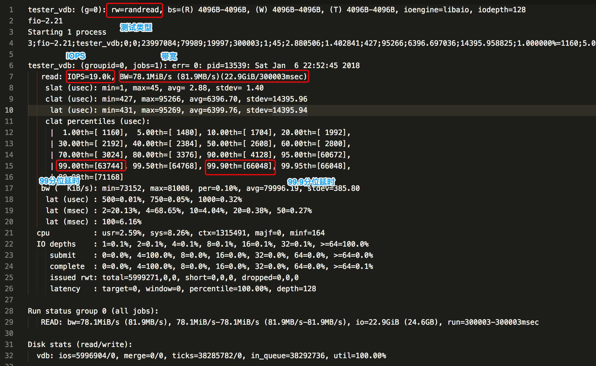

## fio 介绍

fio是一个基于命令行的磁盘测试工具，能够准确的反映出磁盘的性能。fio是C语言写的，所以可以通过源码在不同平台进行编译安装。
[https://github.com/axboe/fio](https://github.com/axboe/fio)

## 1.准备

fio的安装需要一些依赖包，而且fio测试需要指定引擎，比如linux下常用引擎为`libaio`，windows下有专用的`windowsaio`。

### 安装

1. 先安装引擎`libaio`(多种方式): 
   1. `yum install -y libaio`
   2. wget http://common-pkgs.oss-cn-beijing.aliyuncs.com/fio/libaio-0.3.109-13.el7.x86_64.rpm
      * rpm -ivh libaio-0.3.109-13.el7.x86_64.rpm
   3. wget http://common-pkgs.oss-cn-beijing.aliyuncs.com/fio/libaio-devel-0.3.109-13.el7.x86_64.rpm
      * `rpm -ivh libaio-devel-0.3.109-13.el7.x86_64.rpm`
2. 下载fio源码包：wget http://common-pkgs.oss-cn-beijing.aliyuncs.com/fio/fio-2.21.tar.gz
3. 安装gcc编译器： `yum install -y gcc`
4. 安装fio:
   1. `tar zxvf fio-2.21.tar.gz`
   2. `cd fio-fio-2.21`
   3.  `./configure && make && make install` 

## 2.测试

### 2.1参数介绍

```shell
ioengine : 引擎
bs :block size, 测试区块大小
iodepth : 测试深度
direct=1
filename : 测试文件路径，指定位置为要测试的磁盘
group_reporting=1
runtime : 测试时间
rwmixread : 读写混合测试，读的比例
rw : 测试类型，顺序读，顺序写，随机读，随机写，随机读写等
numjobs : 
```

### 2.2参数选择

1. 测试IOPS时,` bs=4k`，`iodepth=128`, rw选择随机读、写
2. 测试bandWidth时, `bs=1024k`, `iodepth=64`, rw选择顺序读、写
3. 测试latency时， `bs=4k`, `iodepth=1`, rw选择随机读、写

### 2.3 案例

1. 多路随机写磁盘测试

```shell
fio -filename=/dev/sdc -direct=1 -iodepth=128  -thread -rw=randwrite -ioengine=libaio -bs=4k -size=10G  -numjobs=1  -runtime=300 -group_reporting  -name=iotest
```

2. 单路随机读写测试，读占70%。

```shell
fio -filename=/dev/sdc -direct=1 -iodepth=1  -thread -rw=randrw rwmixread=70 -ioengine=libaio -bs=4k -size=10G  -numjobs=1  -runtime=300 -group_reporting  -name=iotest
```

### 2.4多块盘测试

多块磁盘测试方法与单盘相同，有几块磁盘就同时跑几个fio测试，测试结束后，结果相加即为IOPS或BandWidth结果。

## 3.结果分析


