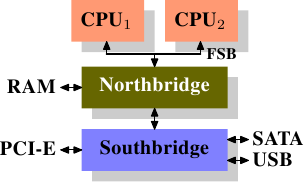

有两种类型计算机， 分别以不同的方法管理物理内存。

(1) UMA计算机（一致内存访问， uniform memory access)将可用内存以连续方式组织起来（可 能有小的缺口）。 SMP系统中的每个处理器访问各个内存区都是同样快。

(2) NUMA计算机（非一致内存访问， non-uniform memory access)总是多处理器计算机。 系统的 各个CPU都有本地内存， 可支持特别快速的访问。 各个处理器之间通过总线连接起来， 以支持对其他 CPU的本地内存的访问， 当然比访问本地内存慢些。

## (N)UMA

南北桥的结构如下：

​            **UMA结构**                                  **NUMA结构**

### UMA

所有CPU(前一个示例中的两个， 但可能有更多）通过公共总线（前端总线， FSB)连接到北桥。 北桥包含存储器控制器， 其实现决定了用于计算机的RAM芯片的类型。

### NUMA

使用这样的架构， 可以使用与处理器一样多的存储库。 在四CPU机器上， 内存带宽增加了四倍， 而不需要具有巨大带宽的复杂北桥。 将内存控制器集成到CPU中具有一些额外的优势

#### 缺点

1. 访问所有内存需要跨越CPU进行互连通信。
2. 有NUMA因子存在， 节点连接越复杂， NUMA因子越高

### NUMA因子

在最简单的NUMA形式中， 处理器可以具有本地存储器（参见图2.3）， 其访问比其他处理器本地存储器更便宜。 这种类型的NUMA系统的成本差异不高， 即NUMA因子很低。

按照AMD使用模型， 节点的有效拓扑是超立方体， 它将节点数限制为2 C, 其中C是每个节点具有的互连接口数。 对于具有2 n个 CPU的所有系统， 超立方体的直径最小。

### OS 支持

最理想的情况是进程的内存分配在cpu对应的内存本地节点上， 但实际上， 对于本地阶段内存不够的情况， 操作系统别无选择只能选择成本更高的节点。

对于libc这样的基本运行时库， 很多进程和线程都要使用， 这意味着除了少数处理器之外的所有处理器都要有远程访问权限， 理想情况下操作系统会将此类内容镜像到每个物理RAM中， 并使用本地副本。 但很多时候都难以实现。

对于NUMA因子较小的情况， 要利用所有的内存， 默认策略是对内存条带化， 保证系统所有内存的平等使用。 副作用就是， 可以在cpu之间自由迁移进程。

事实上Linux识别到NUMA架构后， 默认的内存分配方案就是： 优先尝试在请求线程当前所处的CPU的Local内存上分配空间。 如果local内存不足， 优先淘汰local内存中无用的Page(Inactive, Unmapped)。 导致swap产生， 而不是从远程节点分配内存， 这就是swap insanity现象。

### 远程访问成本

通常来说写成本要比读的成本高。 2跳读取和写入分别比0跳读取慢30％和49％。 2跳写入比0跳写入慢32％， 比1跳写入慢17％。 处理器和内存节点的相对位置可以产生很大的不同。

### NUMA对大内存应用的坑（如MySQL)

* CPU规模因摩尔定律指数级发展， 而总线发展缓慢， 导致多核CPU通过一条总线共享内存成为瓶颈
* 于是NUMA出现了， CPU平均划分为若干个Chip(不多于4个）， 每个Chip有自己的内存控制器及内存插槽
* CPU访问自己Chip上所插的内存时速度快， 而访问其他CPU所关联的内存（下文称Remote Access)的速度相较慢三倍左右
* 于是Linux内核默认使用CPU亲和的内存分配策略， 使内存页尽可能的和调用线程处在同一个Core/Chip中
* 由于内存页没有动态调整策略， 使得大部分内存页都集中在CPU 0上
* 又因为Reclaim默认策略优先淘汰/Swap本Chip上的内存， 使得大量有用内存被换出
* 当被换出页被访问时问题就以数据库响应时间飙高甚至阻塞的形式出现了

### NUMA interleavel

NUMA内存分配策略有一下四种：

* 缺省default: 总是在本地节点分配（当前进程运行的节点上）。
* 绑定bind: 强制分配到指定节点上。
* 交叉interleavel: 在所有节点或者指定节点上交叉分配内存。
* 优先preferred: 在指定节点上分配， 失败则在其他节点上分配。

使用interleavel 可以在一定程度上很好的解决这个问题。 像MySQL这种外部请求随机性强， 各个线程访问内存在地址上平均分布的这种应用， Interleave的内存分配模式相较默认模式可以带来一定程度的性能提升。

此外 [各种](https://www.cs.sfu.ca/~fedorova/papers/asplos284-dashti.pdf) [论文](http://www.lst.inf.ethz.ch/people/alumni/zmajo/publications/11-systor.pdf) 中也都通过实验证实， 真正造成程序在NUMA系统上性能瓶颈的并不是Remote Acess带来的响应时间损耗， 而是内存的不合理分布导致Remote Access将inter-connect这个小水管塞满所造成的结果。 而Interleave恰好， 把这种不合理分布情况下的Remote Access请求平均分布在了各个小水管中。 所以这也是Interleave效果奇佳的一个原因。

> 参考链接

1.[NUMA的原理与局限](https://blog.csdn.net/liguangxianbin/article/details/80797400)
2.[NUMA架构的优缺点](https://www.cnblogs.com/klb561/p/9053692.html)
