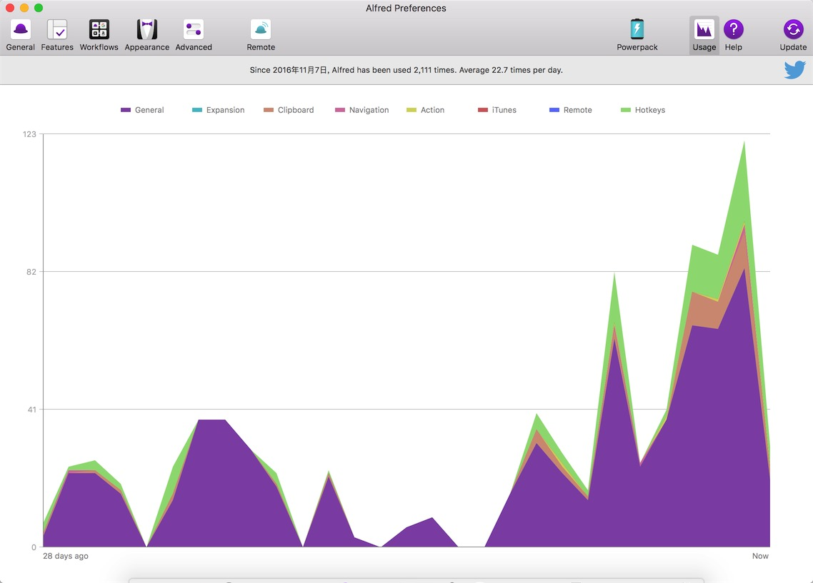
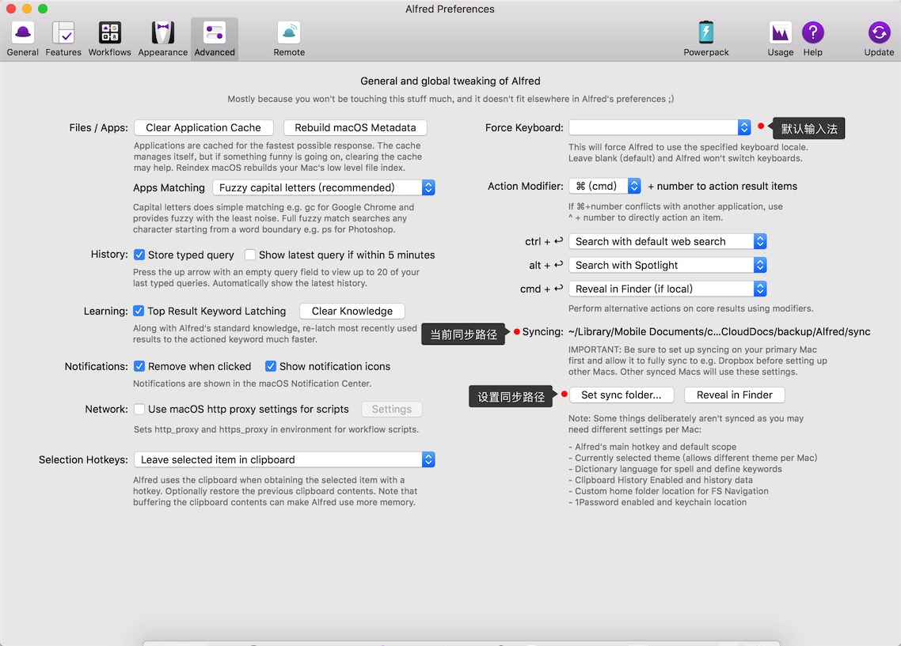

Alfred被称为Mac中的效率神器，没有之一，一点都不为过。MalTalk作者也多次推荐这款软件，少数派也有很多关于这个软件的教程及分享。可见这个软件的确有它的神器之处。

下图为我最近一段时间的使用频率，可见我已经离不开它了，真的太方便了。

## 功能定位
Mac下自带一个功能强大的搜索工具Spotlight，能够实现全局文件搜索、字典翻译、文件查看预览、计算机、单位换算等功能，已经很强大了。

但对Alfred来说，这只是基础功能。除此之外还有很多其他的基础功能，包括音乐控制、1Password查看、文件管理、剪切板管理、snippets管理、联系人查看、字典查询、系统控制等功能。

高级功能叫workflow，即工作流，能够调用系统开放的API，并能够执行多种脚本(包括bash、PHP、Python、ruby、AppleScript等)，能够做到很多意想不到的事，将经常用的功能自动化，仅需按几个键就能够自动执行。

## 相关资料
- 推荐：★★★★★
- 官网：<https://www.alfredapp.com>
- 价格：软件免费，但限制高级功能，购买Powerpack可解锁全部功能。
    

    |类型 |价格|
    |----|---|
    |Single Licence:单用户许可   |`£19`|
    |Family Licence:家庭许可    |`£29`|
    |Mega Licence:单用户永久许可 | `£39`|
- 平台：仅支持MacOS平台，Windows平台也有类似的软件
    - [Wox](https://github.com/Wox-launcher/Wox)
    - [Github](http://www.getwox.com)
    - [参考文章](http://sspai.com/33460)。
- 版本：最新版本为3.3。

## 最优化设置
- 启动：`option` + 空格
- 同步(syncing)：在`Advanced`选项卡中点击`Set sync folder`按钮把同步文件设置到iCloud中即可保持同步备份。
- 权限：
    - 开机自启动：勾选开机自启动；
    - 授权控制电脑权限，软件会运行脚本，调用系统API，因此需要权限。

## 基础功能 
- 浏览器搜索

    > 能够调用网站的搜索API进行网站搜索，选中用浏览器打开。
- 文件搜索

    > 能够快速查找到本机的文件，并对文件进行预览、打开、复制、删除等操作，且文件操作能够进行扩展
- 音乐控制

    > 在Alfred中可对iTunes音乐进行控制
- 剪切板管理

    > 开启剪切板(Clipboard)功能，能够保存之前复制过的内容，并进行选择粘贴，还能进行合并复制等操作。成功的干掉了`Paste`软件
- Snippets
    > 代码块工具，输入指定文字，用预定义好的一段文本进行代替，成功干掉了`TextExpander`。虽然很方便了，但还是比不上`Dash`的这个功能。

## 付费解锁功能
- workflow功能
- 执行终端命令
- 查看1Password

## workflow

### 常用workflow
- [packal](http://www.packal.org)：Alfred的workflow管理工具，能够搜索、添加、删除workflow等，必备。
- [TripMode](http://www.packal.org/workflow/tripmode)：TripMode开关
- [ariafre](http://www.packal.org/workflow/ariafre)：管理Aria2下载
- [Evernote](http://www.packal.org/workflow/evernote)：印象笔记工具
- [stackoverflow](http://www.packal.org/workflow/stackoverflow-search)：快速搜索stackoverflow问题
- [Github repos](http://www.packal.org/workflow/github-repos)：Github仓库工具

### 学习制作workflow
升级到3.3版本之后，Alfred已经能够支持json了，而不再仅仅支持xml了，这样制作workflow更加简单容易，只要你会一门脚本语言就能制作属于自己的workflow了。

但面对全英文的界面，以及众多的选项，该如何入手呢？

其实官方提供了详细的教程，以及现成的demo和模板，可以用来学习。

## 相关资源
### [少数派上的评测及教程](http://sspai.com/tag/alfred)
- [使用 Alfred 提高你的工作效率 | Matrix 精选](http://sspai.com/35927)
- [它已不仅仅是一款 Mac 效率启动器：Alfred 3.0 新版详解](http://sspai.com/34468)
- [减少点击跳转：5 款提高操作效率的 Alfred 扩展推荐](http://sspai.com/33279)
- [从零开始学习 Alfred：基础功能及设置](http://sspai.com/32979)

还有很多……

