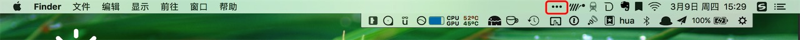
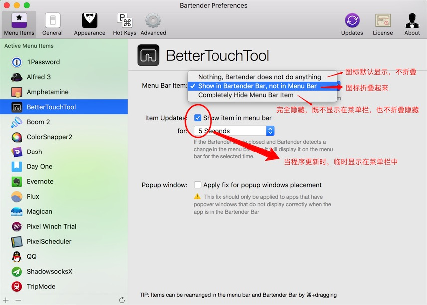

## 功能定位
Mac屏幕右上角是用来放软件的快捷功能图标的，很多软件都会在这里放一个图标，点击图标能够实现众多功能，但很多时候我们会在后台启动很多个不同的应用来辅助我们使用，这样会留下一长条的图标，很不清爽，大多数图标是用来在后台工作的我们几乎不会去点击。Bartender2很好的解决了这个痛点，能够把不需要的图标隐藏，在需要的时候才显示出来。
> 令人崩溃的图标

> 清爽的体验

> 点击红色标记的按钮展开图标

## 相关资料
- 推荐：★★★★★
- 官网：
- 价格：
- 平台：Mac
- 版本：2.16

## 最优化设置
系统应用的图标也可以收到其中折叠显示。

不要忘了勾选开机自启哦
