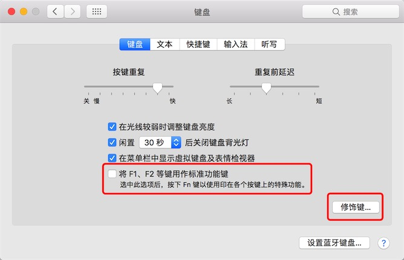
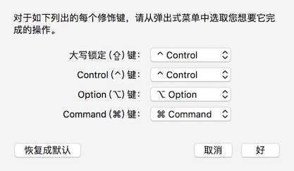
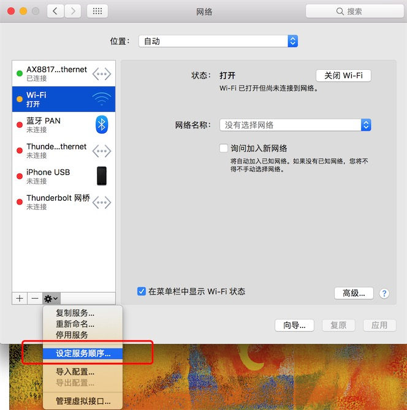
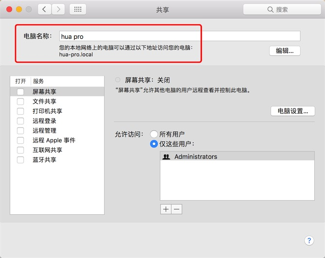
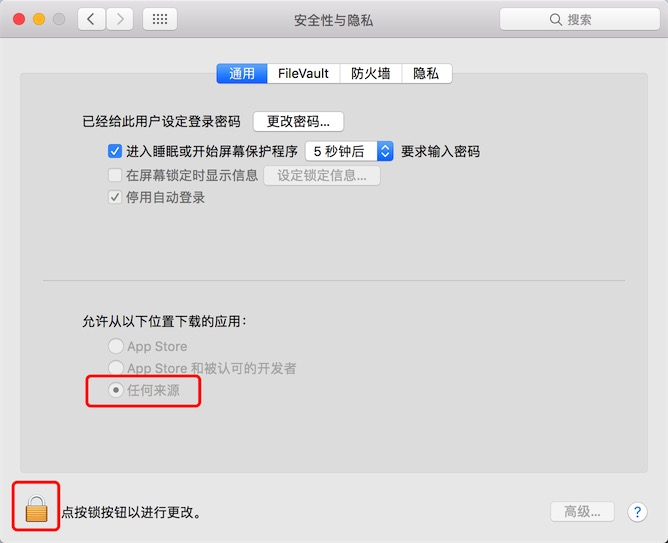

## mac触摸板设置

> mac的触摸板是所有触摸板中最好用的，没有之一，有几个细节可以注意一下。

1. mac的触摸板能够识别手掌，当打字的时候，手掌会触碰到触摸板，但手掌的触摸并不会引起鼠标、指针的移动，这个触摸被mac自动过滤到了。你可以试一下，手背是能够识别的，指关节是能够识别的，而唯独手掌识别不了。可见是很用心的。
2. 2015款及之后的mac触摸板去掉了机械按压，反之以电动马达震动提供反馈，效果比之前的机械按压还要好。正常使用根本感受不到区别，而且在某些应用中按压力度可以出发多级震动反馈，mac处于关机状态下，触摸板是没有震动反馈的，也就是说触摸板是按压不下去的。
3. mac触摸板拥有出色的手感，使用起来相当顺滑，除了设计、游戏之外，根本就不需要鼠标。
4. mac的触摸板拥有丰富的默认手势，从1个手指到4只手指。且借助于第三方软件能够自定义上百种手势，可谓功能繁多。

### 最优设置

推荐除了 `静默点按` 之外，勾选全部功能，有几个默认值需要修改。

* 查询与数据检测器：推荐改为 `用三个手指轻点` ；
* 在全屏幕显示的应用之间清扫：推荐改为 `用四个手指左右清扫` ;

**有个重要的功能在升级到10.11系统之后换了位置**
打开 `辅助功能` ，选择左侧的 `鼠标和触控板` , 点击右侧的 `触控板选项…` ，勾选 `启动拖移` ，并选择 `三指拖移` 。

这样最优化的触摸板初级设置就设置好了。

### 功能解释

* 三指拖移：在使用鼠标的时候，按住鼠标左键不松手拖动一个文件，文件会跟着鼠标走。在mac触摸板中，是不分左右键的，一般的右键操作通过 `有两个手指点按或轻点` 实现。按住鼠标左键不松手并移动就是 `三指拖移` ，在这里使用三个手指，在触摸板上移动即可实现拖动效果。
* 查询与数据监测器：在mac的文本显示中，在单个文字或单词中 `用三个手指轻点` 即可显示字典功能，进行查询。在Safari中，三指轻点链接，可对链接页面进行预览。

---

## 按键映射

### f1-f12及功能键切换
在系统偏好设置中，选择 `键盘` ，在键盘下方会有F1-F12按键的作用，默认是mac的特殊功能，勾选则转换为F1-F12功能键。推荐不勾选，mac不像Windows对F1-F12依赖那么严重。几乎很少有会用到的情况，相反调节屏幕亮度、音量等却会经常用到。



### 修改修饰键

在 `键盘` 设置的右下角，能够修改 `Caps lock` , `Control` , `Option` , `Command` 四个按键的功能，比如vim党就会把 `Caps lock` 键修改为 `Control` 的功能。



---

## 网卡顺序



---

## 主机名设置



---

## QuickLook预览

mac下有个最强大的默认软件，就是预览(QuickLook)，默认状况下它可以预览绝大多数文件格式(jpg、mp3、mp4、ppt、txt、doc、pdf等), 通过安装插件还可以预览更多的格式(高亮代码、压缩文件、markdown、json文件等等)。

选中一个文件，按下 `空格` 即可预览，按下上下左右键可以切换文件预览。再次按下 `空格` 可结束预览。

* 插件安装参考文章[链接](http://sspai.com/31927)

---

## 显示隐藏文件

升级到10.12系统之后，可以使用 `command` + `shift` + `.` 来打开和关闭显示隐藏文件

10.12系统之前，可以通过在终端输入如下代码实现

``` bash
# 显示：
defaults write com.apple.finder AppleShowAllFiles -bool true
#隐藏：
defaults write com.apple.finder AppleShowAllFiles -bool false
```

---

## 允许任何软件来源



在升级到10.12后，系统默认隐藏了任何来源选项，可以通过以下方法让它显示出来。

> 在终端中输入以下代码

``` bash
sudo spctl --master-disable
```

---

## 安装xcode工具

``` bash
xcode-select --install
```

---

## mac os 11.11关闭SIP(System Integrity Protection (SIP) 系统完整性保护)

* 安装 TotalFinder 必须使用安装U盘启动进入安装界面
* 打开终端，输入如下命令： `csrutil enable --without debug` ，然后回车，然后reboot重启

---

## Mac的启动组合键

| 启动期间按住               | 描述                                                   |
|--------------------------|--------------------------------------------------------|
| ⇧                        | 以安全模式启动                                           |
| Option(⌥)                | 启动进入启动管理器，从中选取其他启动磁盘，若可用                |
| C                        | 从可用CD、DVD或USB启动                                    |
| D(Option+D)              | 从内建的Apple Hardware Test或Apple Diagnostics使用工具启动 |
| Option(⌥)+Command(⌘)+P+R | 重置NVRAM或PRAM                                         |
| Command(⌘)+R             | 从内建的mac OS恢复系统服务                                |
| Command(⌘)+S             | 以单用户模式启动                                         |
| X                        | 正常从非macOS移动磁盘启动的情况下，会以macOS启动              |
| T                        | 以目标磁盘模式启动                                        |
| Command(⌘)               | 以详细模式启动                                           |
