GitBook是基于Git的电子书写作工具， 借助于Alfred的工作流可以非常方便的管理GitBook, 包括build, export、 serve、 open等功能。 以下是成品图。


可以实现如下功能：


01. 打开本地渲染的静态html文件， 如果没有则执行 `build` 进行渲染。
02. 安装插件 `gitbook install plugin` 。
03. 在finder中打开该电子书目录。
04. 启动本地服务器 `gitbook serve` 。
05. 导出电子书， 支持pdf、 epub、 mobi格式， 需要 `calibra` 支持

该 `workflow` 整体比较简单， 但其中依然有很多坑， 接下来， 我将带领大家如何一步一步完成该 `workflow` 的搭建， 你只需要会简单的shell脚本就可以了。

### 用到的组件

01. List Filter
02. Arg and Vars
03. Review in finder
04. Filter
05. Run Script
06. Open File
07. Terminal Command
08. Open URL
09. Post Notification
10. Copy to Clipboard

### 用到的技术

01. Alfred的变量
02. Alfred的判断组件

通过这些组件的应用， 可以快速的熟悉每个组件的用法及用途， 能够更好的帮助我们进行接下来更加随意的搭建 `workflow` 。

> Tips: 首先Mac上要先安装 `gitbook-cli` 命令行客户端， 使用 `npm` 直接安装就好 `$ npm install -g gitbook-cli` , 当然要使用 `npm` , 需要先安装 `node` 。

## 第一步： 获取所有的电子书列表

首先设置一个环境变量， 设置一个路径， 该路径下的每一个文件夹都会是一本GitBook电子书的路径。 如下：


在Finder中的显示如下：

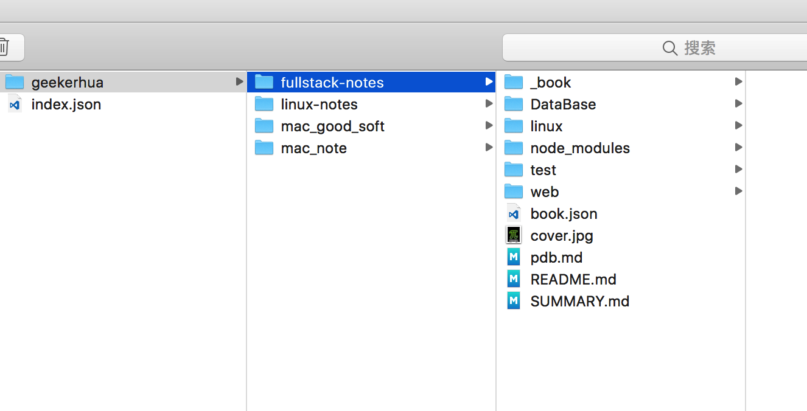

## 第二步： 列出所有操作

### 1. 在workflow中添加一个 `List Filter` :

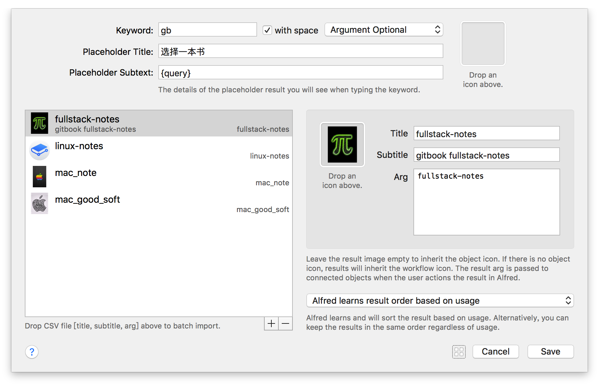

其中左侧的每一项都对应一本电子书， 为了方便， 名称与电子书名称相同， 右侧 `Arg` 是选择该项之后的变量， 用来区分选择了那一项， 这个变量会被带到下一步中。
激活 `Alfred` 显示如下：

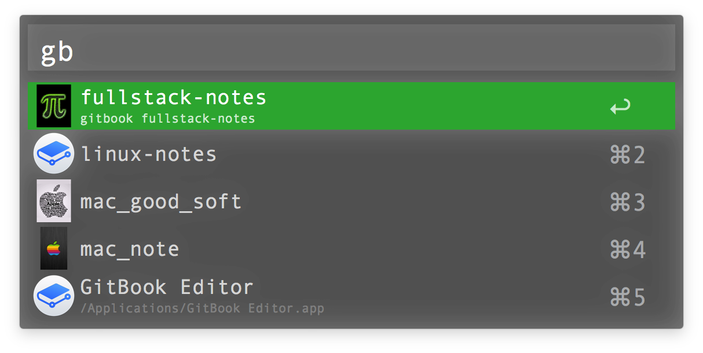

### 2. 保存变量

第一步选中之后， 会产生一个变量， 需要保存下来， 以供后续使用， 如下2、 3是两个相同的 `Arg and Vars` 组件， 功能是把刚才的变量进行保存， 保存为 `book` , `{query}` 就是上一步提到到的 `Arg` 。

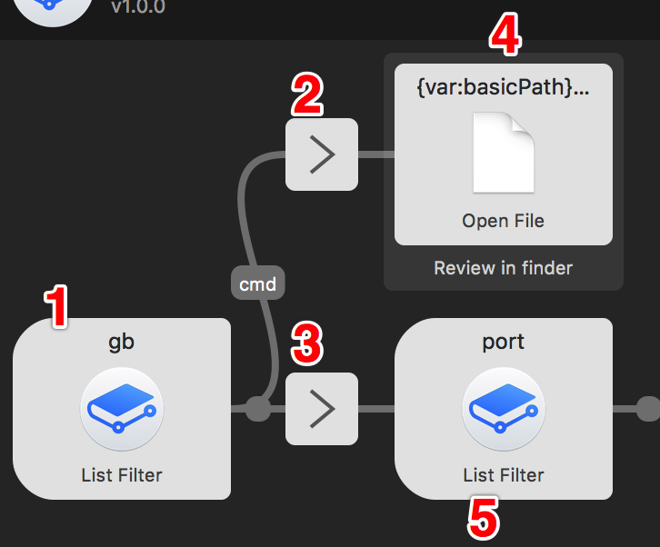

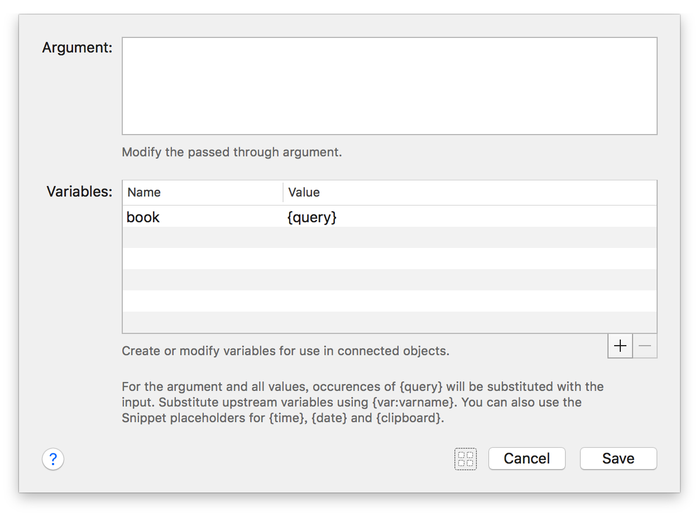

仔细看， 上边的连线（1->2)中出现了 `cmd` 标识， 说明在选择列表的同时按下 `cmd(⌘)` 会走到这条分支上。 如何设置呢， 鼠标双击这条线， 会弹出如下设置项， 支持 `ctrl` 、 `alt` 、 `cmd` 、 `fn` 、 `shift` 组合键。

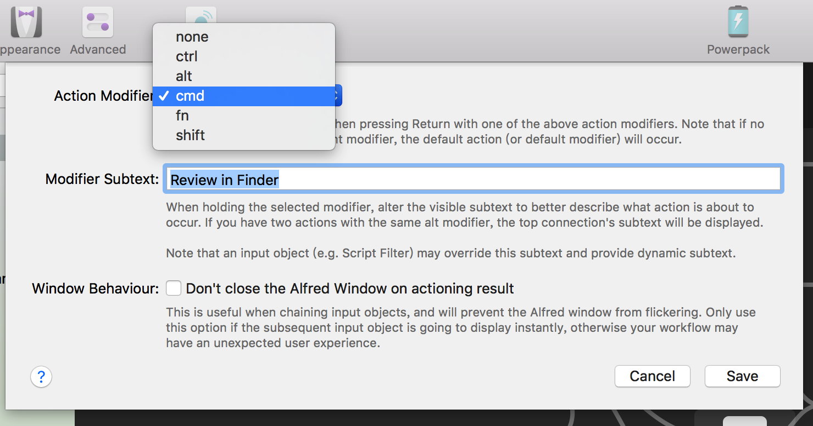

### 3. 在finder中显示电子书

在 `cmd` 状态下选中列表会触发下一步操作 `4` ， 这里设置的是 `Review in finder` , 写法如下， 这里第一次涉及到使用变量， 两个变量， 一个是在环境变量中设置的， 一个是从上一步获取到并保存下来的。

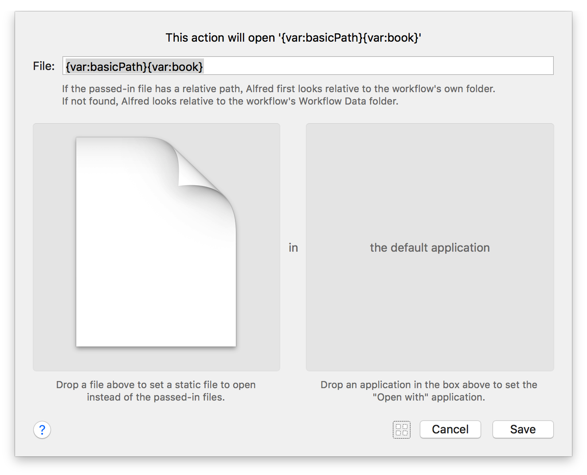

## 第三步： 执行不同的操作

### 1. 列出不同的操作

在 `5` 模块设置如下， 其中每个列表项的Arg都对应为 `gitbook` 中的命令， 这样很多情况下该变量便可以直接复用。

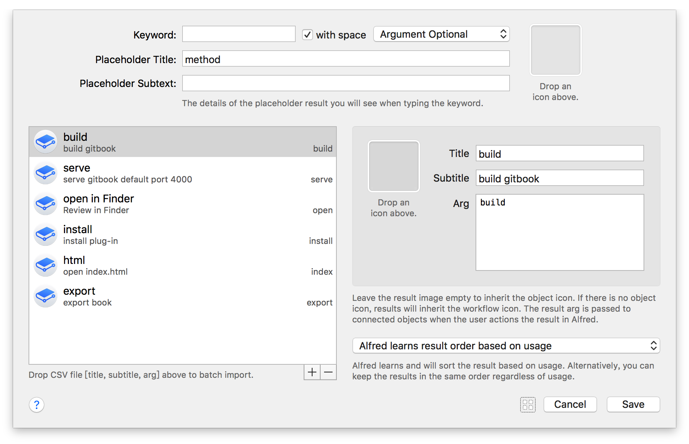

### 2. 保存变量

将操作的变量进行保存， 保存为 `action` :


### 3. 操作分发

现在我们能够获取到选择了那本电子书， 也能够获取到想要进行的操作了， 接下来就要处理如何执行对应的操作了。

* `Filter` 过滤

如下图， 是一个 `Filter` 组件， 可以对传入的变量进行过滤， 相当判断， 多个 `Filter` 组件联合使用， 可以构成 `if……else if…… else` 的效果。

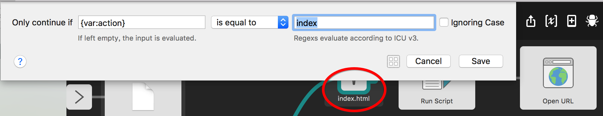

### 4. 执行操作

> Tips: 对于 `Run Script` 组件， 有两个注意点：
> 1. 在bash环境下， 变量的引用方式选择 `with input as argv` , 这是bash标准的变量使用方式， 如果选择第二项 `with input as {query}` , 那在引用变量的时候就需要想前边写的使用 `{query}` 这种格式了。
> 2. Alfred的Bash不加载 `~/.bash_profile` 文件， 因此是没法直接执行 `/usr/bin/local` 下的命令的， 需要写出完整路径， 或者修改 `PATH` ， 我们选择第一种方式， 这样会很简单。

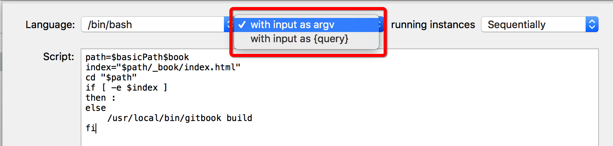

#### 4.1 open index.html 与 serve

> `Run Script` 执行脚本

``` bash
path=$basicPath$book
index="$path/_book/index.html"
cd "$path"
if [ -e $index ]
then :
else
	/usr/local/bin/gitbook build
fi
```

如下图可以看到， 执行完一个脚本之后， 还会再次进行 `Filter` 过滤， 两个操作再次分开，

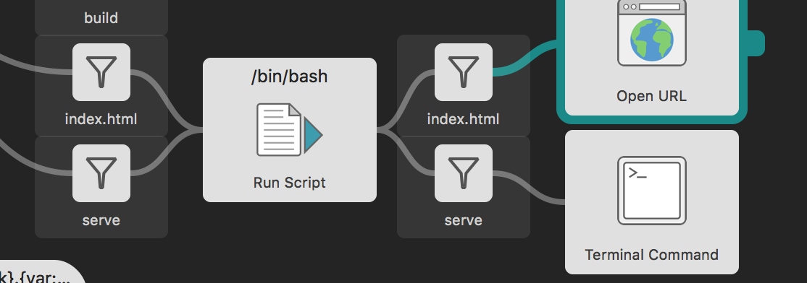

* `Open URL` :

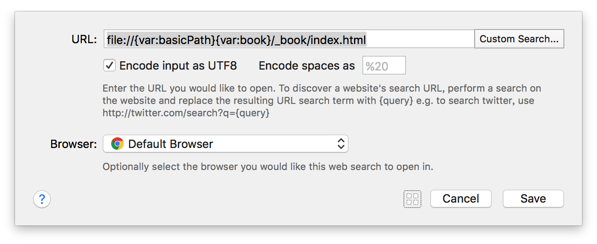

* `Terminal Command`

``` bash
cd {var:basicPath}{var:book}
gitbook {var:action}
```

#### 4.2 install 与 build

> `Run Script`

``` bash
cd $basicPath$book
/usr/local/bin/gitbook $action
```

* `Copy to Clipboard`

``` bash
file://{var:basicPath}{var:book}/_book/index.html
```

## 第四步： 导出电子书

> 剩下的 `export` 导出电子书就是一个套路了， 就不详细介绍说明了

### 1. `List Filter`

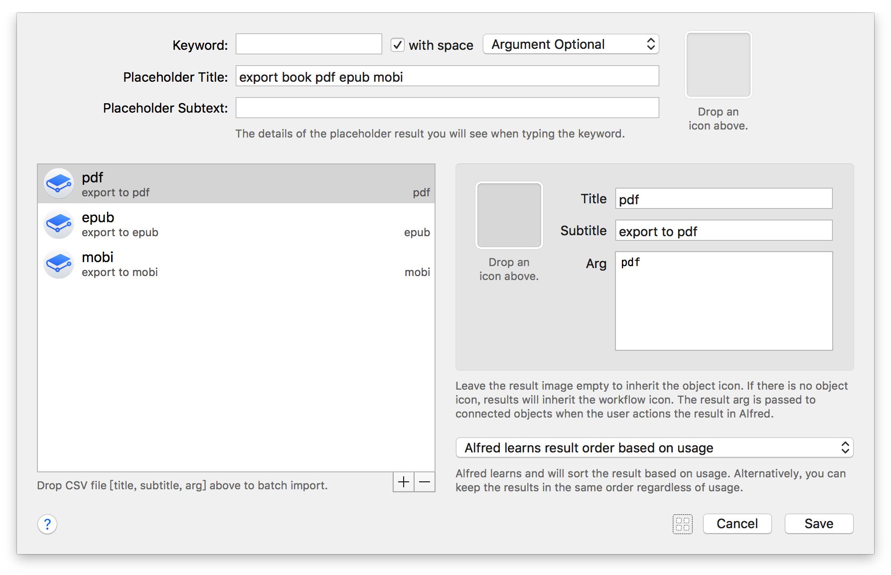

### 2. `Arg`


### 3. `Run Script`

``` bash
cd $basicPath$book
mkdir -p ~/Downloads/book
/usr/local/bin/gitbook $type . ~/Downloads/book/$book.$type
```

### 4. `Post Notification`

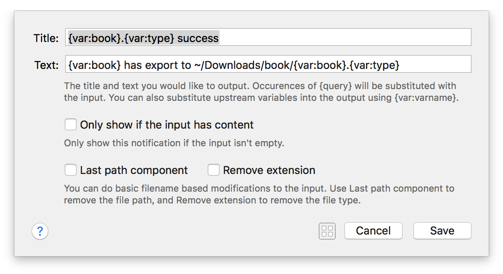
