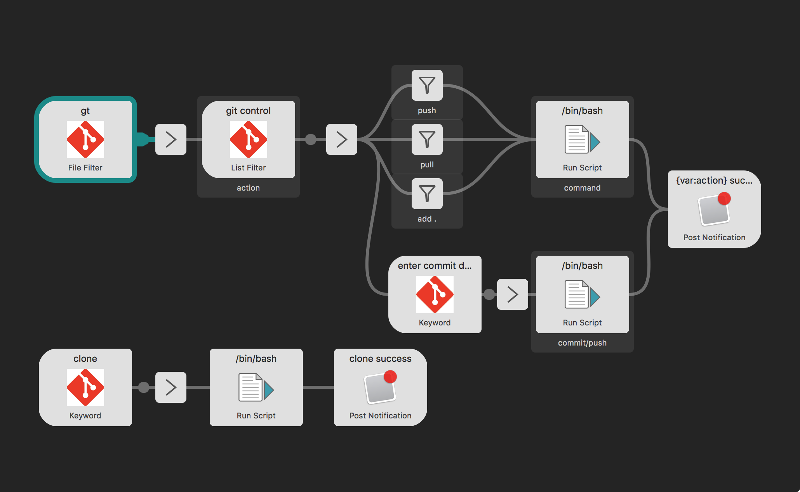
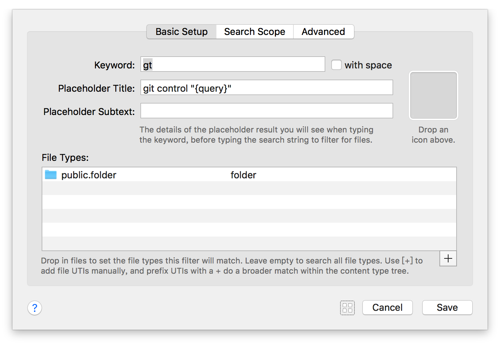
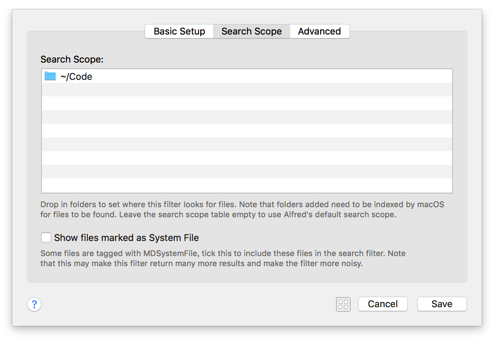
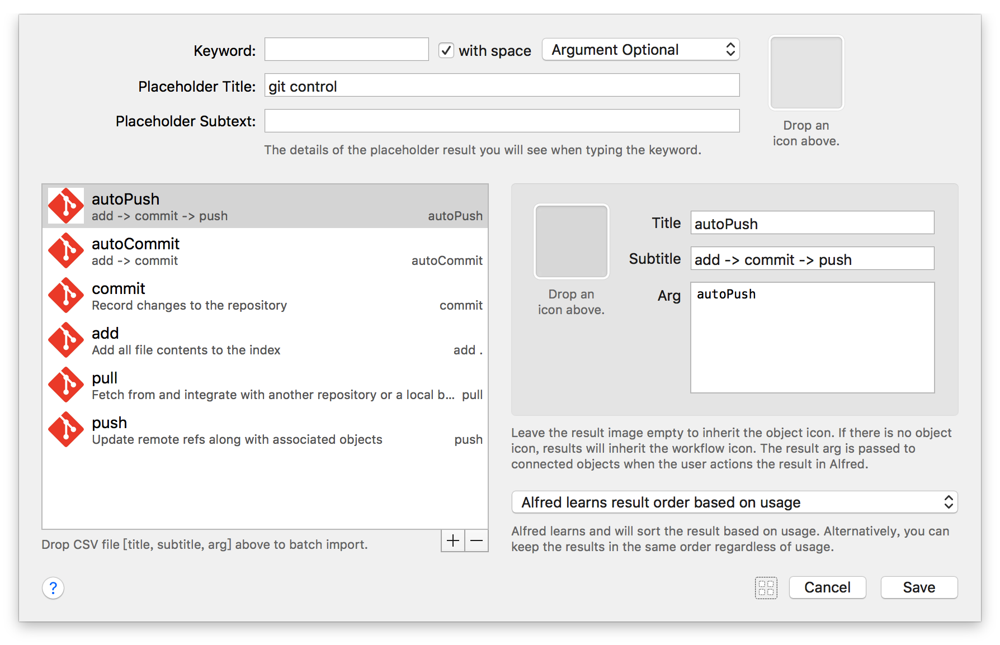
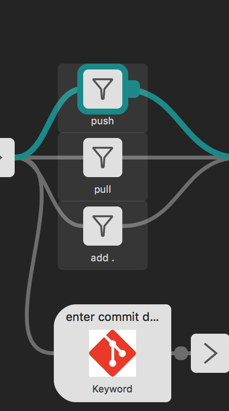
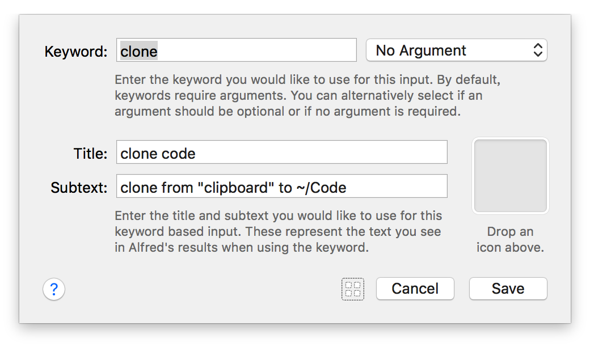

使用Alfred的workflow管理所有的git仓库， 简单又快捷， 一起行动吧！

最终效果图：


实现的功能如下：

可见， 常用的功能都实现了。

用到的组件如下：

- `File Filter`
- `List Filter`
- `Arg and Vars`
- `Filter`
- `Run Script`
- `Keyword`
- `Post Notification`

## 1. 显示本地所有git仓库

1. 这里需要用到 `File Filter` 组件， 该组件能够过滤出制定目录下的制定格式文件， 当然也支持过滤文件夹， 我们就用它来只显示制定路径下的文件夹。 该组件设置如下图：

  
  

- 在 `Basic Setup` 选项卡中设置想要显示的文件类型， 这里我们只显示文件夹。
- 在 `Search Scope` 选项卡中选择需要搜索的文件夹， 因为我的代码都是放到一个文件夹下的， 因此只需要添加 `~/Dode` 文件夹即可。

2. `File Filter` 组件后接 `Arg and Vars` 组件， 将输入 `{query}` 保存为 `repo` 变量， 该变量为选中列表项的文件路径。

## 2. 显示所有支持的操作

- 使用 `List Filter` 组件显示支持操作

这里我们选择如下图6中操作， 后四种是git的基础命令， 前两个是组合命令。 为了方便简单， `Arg` 也是列表项的标题， 同时也是git的命令名称。


- 然后用 `action` 变量进行保存
- 接着要进行操作分发

  

上边三种操作都是单一基础命令（push/pull/add .)， 剩下三个操作都涉及到 `commit` 命令， 需要有 `commit description` 。

- 基础命令的执行脚本

```bash
cd $repo
git ${action}
```

- 符合命令

使用 `Keyword` 组件记录键入的 `commit description` 并保存到变量 `desc` 中。 然后是执行脚本 `Run Script` 组件， 脚本如下

```bash
cd $repo

if [ $action = "autoCommit" ]
then
	git add .
	git commit -m "$desc"
elif [ $action = "commit" ]
then
    git commit -m "$desc"
elif [ $action = "autoPush" ]
then
	git add .
	git commit -m "$desc"
	git commit push
fi
```

## 3. clone命令

为了更方便的clone仓库， 我们设想刚刚从github上复制下来了仓库地址， 此时该地址保存在剪切板中， 那最简单快速的clone方式就是激活Alfred, 键入一个命令， 自动clone剪切板中的仓库地址到制定路径。




- `Run Script` 脚本为

```bash
cd ~/Code
git clone ${clipboard}
```
