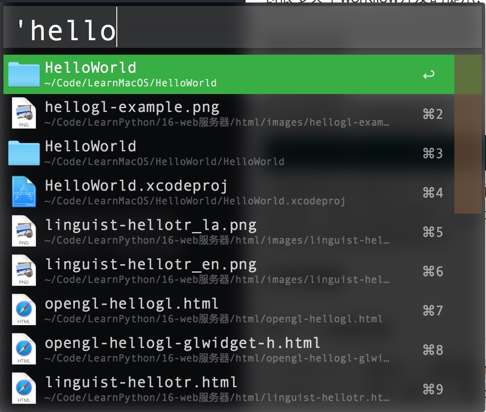
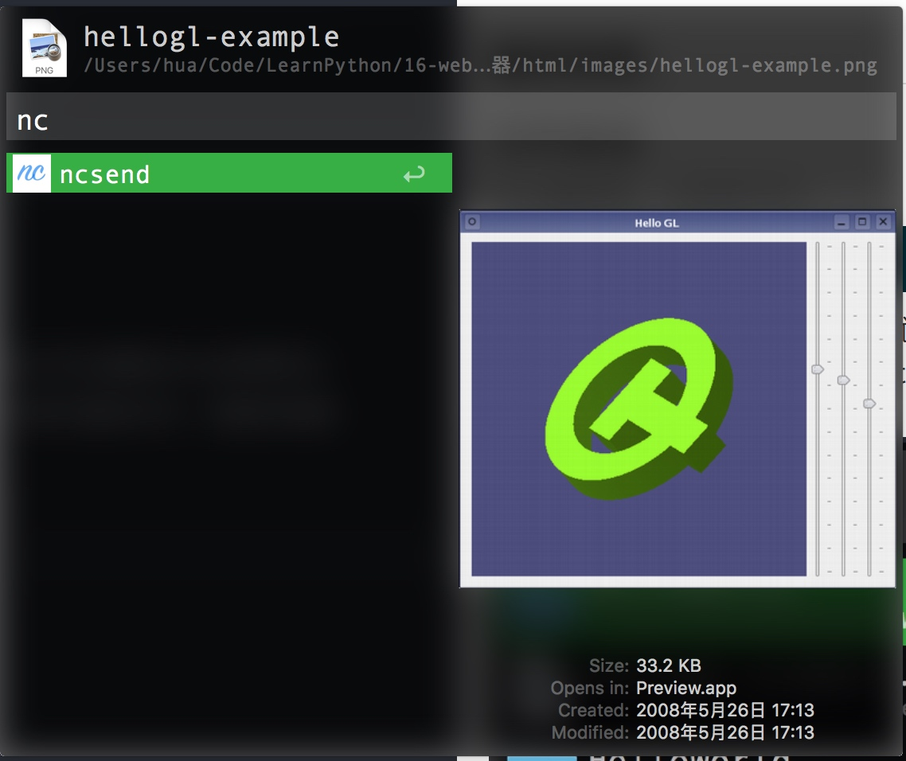
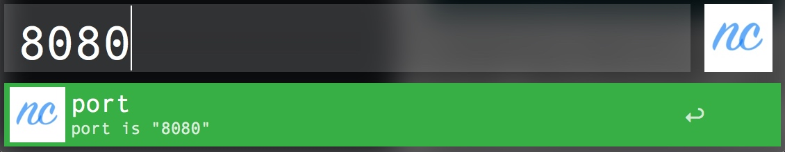

nc是什么， nc是一个简单传输协议。 nc的具体使用在文章后边会做详细的介绍。 简单说就是， 通过nc能够在局域网中传输文件， 由于是基于TCP协议， 无论是速度还是稳定性都很可靠， 除此之外还能进行聊天。 如果说缺点， 那就是传输文件时需要在命令行指定端口号， 而且接收方还要自己输入文件名。

由于前段时间经常使用nc, 所以突发奇想， 想把nc服务写到Alfred的workflow中， 从而简化操作。 虽然对于mac来说， airdrop要比nc好用多了， 但通过这个例子， 还是能学到很多关于workflow开发的提示， 近日后开发更复杂强大的workflow带来些许帮助。

### 文件发送

作为服务端， nc的命令为

``` bash
$: nc -l `port` < `document`
```

只需要指定port端口号， 和文件就行。 既然如此， 我们大可以借助Alfred自带的文件搜索功能， 调出nc发送功能。 这要比直接去Finder中进行查找文件， 或者在终端中输入常常的文件路径要高效的多。







发送一共分三步：

* 用Alfred找到需要发送的文件
* 按下 `Ctrl` 键， 进入文件操作， 选择ncsend命令
* 输入端口号， 按下回车。

即启动一个终端执行发送监听模式， 等待客户端进行接收。 与此同时， 屏幕上会用大字显示出本机的局域网ip和刚才输入的端口号， 方便客户端使用。


### 文件接收

对于文件的接收， nc的命令为：

``` bash
$: nc -n `ip`  `port` > `document`
```

可以看到不仅不要客户端的端口号， 还需要客户端的ip. 刚才的服务端操作已经实现了发送， 并把内网ip和端口号显示在屏幕中了。 客户端只需要借助workflow执行接收命令即可。


接收一共两步：

* 调出nc, 并输入ip和端口号， 使用空格分隔， 按下回车
* 提示输入接收文件名， 按下回车即可接收， 默认保存到 `document` 文件夹下。

由此接收工作也完成了。 整体来说对命令的简化并不是很明显， 但可以以此来简单了解下workflow的工作原理。

## nc——netcat

* server: nc -l `port` < `document`
* client: nc -n `ip`  `port` > `document`

## 用nc聊天

* server: nc -l 10000
* nc `port` 10000

---

## nc (netCat)常用命令

`document` : 在9090端口开启tcp服务器
`ip` : 连接本地ip的9090端口tcp服务器

`nc -l [-u] 9090` : 启动监听， 启动服务器必须
`[-v] [-u] 127.0.0.1 9090` : 显示连接进度
`-l` : 使用udp通信， 默认是tcp, 使用udp连接可以保持一直监听状态
`-v` : 设置超时2秒
`-u` : 检测端口

### tcp聊天

`-w2` : tcp监听9090端口
`-z` : tcp连接9090端口
可以用重定向 '<'/'>', 指定传输内容， 只能响应一个客户端， 客户端断开， 服务器端也会断开

### udp聊天

`nc -l 9090` : udp监听9090端口
`nc 127.0.0.1 9090` : udp连接9090端口
可以用重定向 '<'/'>', 指定传输内容， 只能响应一个客户端， 客户端断开， 服务器端不会断开

### 检查端口

`nc -lu 9090` : 查看指定ip tcp 连接 的 1-100端口
`nc -u 127.0.0.1 9090` : 查看指定ip udp 连接 的 1-100端口

### 远程传输文件

`nc -z 127.0.0.1 1-100` : 监听 9090 端口 并把信息输出到指定文件
`nc -z -u 127.0.0.1 1-100` : 连接服务， 并把文件输出
