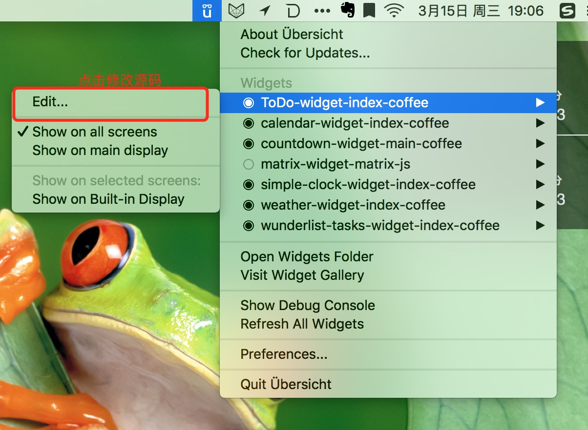
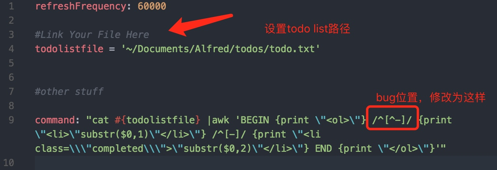
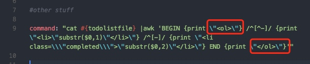

# 效果展示
先来秀一张布置好的桌面图，怎么样是不是很清爽简约啊！

## 资源下载
- Alfred [官网链接](https://www.alfredapp.com)
    - Minimal-TODO [github下载](https://github.com/GeekerHua/alfred-Minimal-TODO/releases)
- Übersicht [官网链接](http://tracesof.net/uebersicht/)
    - 插件商店  [点击访问](http://tracesof.net/uebersicht-widgets/)
    - TODO [点击下载](https://raw.githubusercontent.com/illuminati945/ToDo/master/ToDo.widget.zip)

## 急速教程

- 用到两款软件，`Alfred`和`Übersicht`。
- 外加两个插件，`Übersicht`下的`ToDo`和Alfred下的`Minimal-TODO`。

> tips: 要想运行`Minimal-TODO`，需要拥有`Powerpack`功能，付费还是使用破解版本，随你咯。

本身两个插件是独立运行的，没有任何关联，但两者都是操作一个txt文本，该文本文件每一行为一个TODO任务，使用`-`开头代表任务以完成。

- 在`Übersicht`的桌面插件上会已灰色文字显示，并添加中划线。
- 在`Alfred`的插件中，可以对该文本进行操作，获取所有TODO，添加TODO，删除TODO，标记为完成状态，重置为未完成状态等操作。

`Minimal-TODO`是一个极简todo list工具，todo任务文件放在指定的路径中，例如"~/Documents/Alfred/todos/todo.txt"。

使用“todo”来触发程序，默认会列出添加的todo，“-”开头意味着已经完成的todo。
可以使用的命令列表如下：

- "todo -c"  --> clear all done功能，清除所以已完成项；
- "todo -a"  --> 添加任务，支持一次添加多个，使用空格分割；
- "todo -r"  --> reset all 重置所有任务为未完成状态。

### 必要设置
#### 1.  `ToDo`插件的列表路径，无默认路径
`Übersicht`的`ToDo`插件默认没有设置文件路径，需要用户自己去设置，为了和另一款软件`Alfred`进行无缝协作，建议将文件路径设置在用户Document文件夹下。
#### 2. `ToDo`的BUG处理

默认下载下来的代码有些bug，会导致对于完成的TODO，会显示两遍，一遍是未完成的白色状态，一遍是完成的灰色状态。需要对代码进行修复。

#### 3. `Minimal-TODO`插件的列表路径，有默认路径
`Minimal-TODO`插件的默认路径推荐设置为`~/Documents/Alfred/todos/todo.txt`。你也可以根据需要进行设置，设置方法如下。

---
## 自定义设置
`ToDo`的主题自定义，有序无序列表的设置。默认是`ul`无序列表，改为`ol`即为有序列表

将如图的ol改为ul，即为无序列表。

## 关于`Minimal-TODO`workflow的开发过程
开发过程踩了很多坑，细节日后再补充。

