2016年已经过去2个多月了， 到现在才开始整理我的2016年数字化生活， 这也是收到了 `少数派` 的数字化生活文章评选活动的触发。 阅读了很多篇精选的数字化生活指南， 很多是经典的， 很多是新奇的。 也有很多是碎碎的试探性的。 我感觉， 是时候整理我的数字化生活了， 因为我的数字化生活同样很精彩。

数字化生活， 我们已经离不开手机📱和电脑💻等数字化设备了 ， 当然我还有kindle以及ipad、 🎧等设备， 数字化生活离不开数字化设备， 以下是我的数字化设备。

## 数字化设备

### MacBook Pro💻

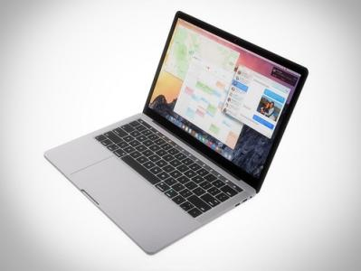

对于一个程序员来说， 最好的生产力工具无非就是MacBook Pro了， 相对于15寸的大屏， 13寸的屏幕无疑是更具有吸引力的， 方便携带、 轻薄、 高清的屏幕、 强劲的性能， 更重要的是那优美的mac OS系统以及类Unix特性。 有人说屏幕太小了， 但对于一个笔记本来说， 多大的屏幕够用呢？ 外接一个显示器🖥， 想要多大就多大， 甚至你可以接两个。 不同于Windows系统只有一个桌面， Mac拥有多个桌面， 借助于圆润的触摸板， 可以很轻松的在多个桌面间进行切换， 大大减轻了对显示器🖥的依赖。

拥有了MacBook Pro, 就拥有了以下好处：

- 一台运行快速的笔记本；
- 高清显示屏， 看的再久眼👁也不会那么累；
- 可以原生运行Linux程序的类Unix系统， 开发环境不愁人；
- 一套能够高效运行的系统；
- 从此告别关机， 开机的等待；
- 告别各种全家桶及病毒的侵扰；
- 原理没有意义的游戏， 将时间用在有意义的事情上。

#### Alfred 3——我真的离不开

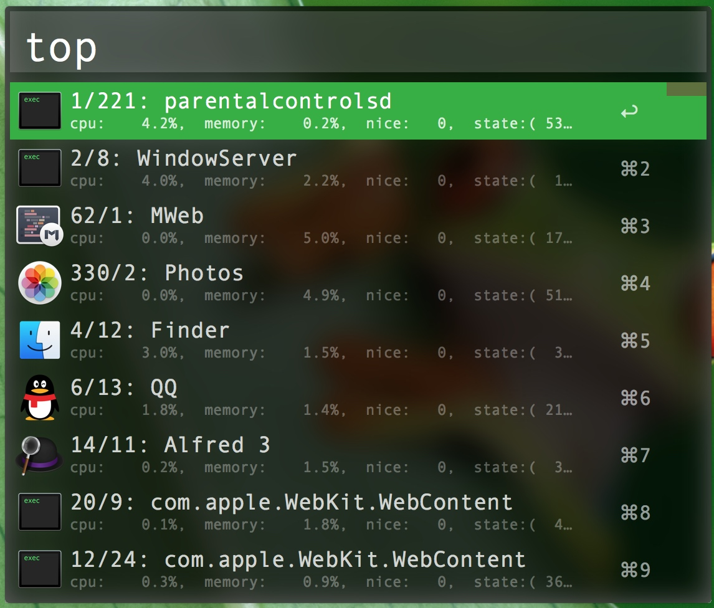
Mac下的效率神器， 没有之一。
对一个热爱折腾的人来说， Alfred真的是最好的礼物🎁， 如果再会写点脚本， 那真的就是把这款神器的能力发挥到最大化， 目前Alfred支持bash、 zsh、 python、 php、 ruby、 Applescript、 JavaScript语言。
开发Alfred的workflow是幸福激动的， 特别是看到自己能够写出一个自己能够使用的并且能够提高效率， 自动完成计划化工作的程序， 真的是很激动很幸福的一件事。 
到目前为止为Alfred开发了5个workflow, 分别是large(显示大号文字）， git(git仓库管理）， hexo(hexo博客管理）， nc(懒人nc传输）， gitbook(gitbook管理）， Minimal-TODO(极简todo工具）。 稍后会有一个关于Alfred的专题， 会详细介绍这几个workflow的开发过程。

#### Übersicht——美哭了的桌面

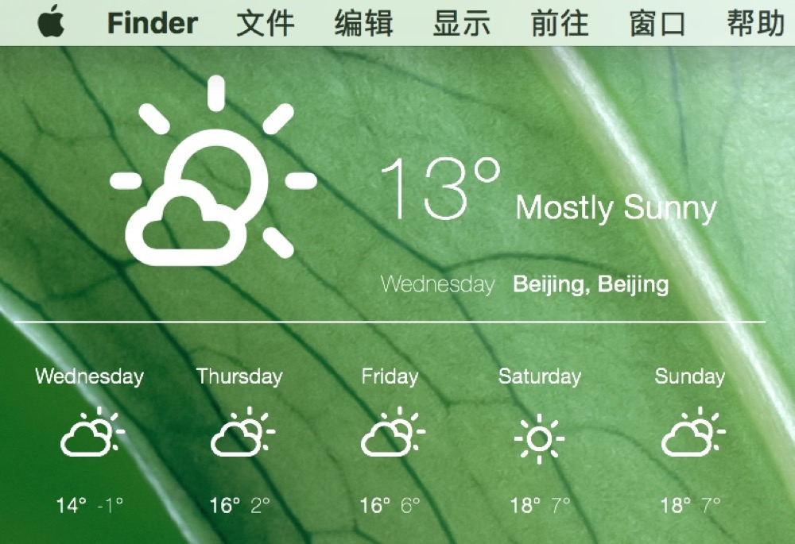
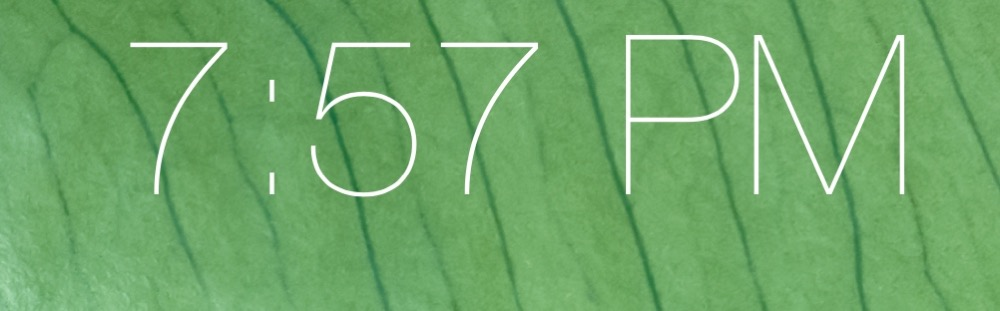
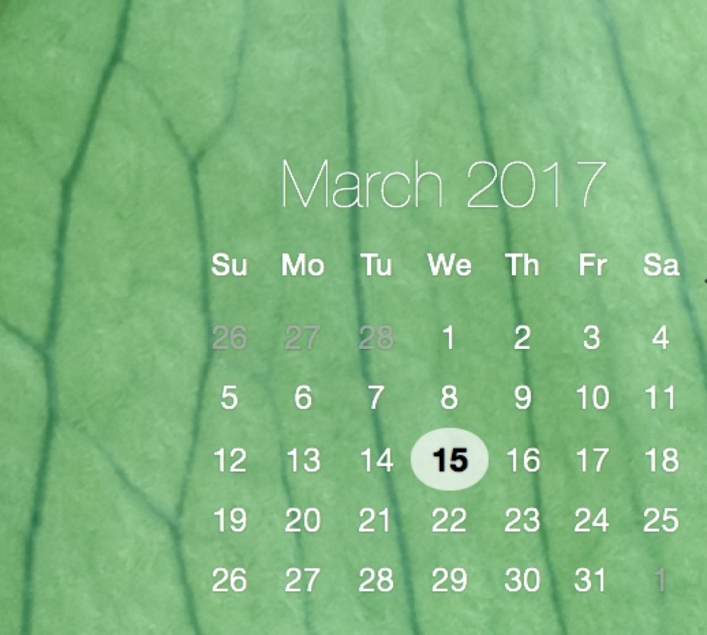
Übersicht是一个能够在桌面上显示coffee脚本的软件， 借助强大的coffee脚本， 能够实现很多意向不到的功能， 且界面简洁美观， 大部分半透明的白色。

借助于Alfred的工作流， 更是能将Übersicht的功能发挥的淋漓尽致， 只不过它只支持coffee语言。

#### Reeder——优美的RSS

数字化生活怎么能离开信息的阅读， 只有自己精挑细选的内容来源， 才是最值得预读的。 RSS在这方面具有绝对的优势， 借助Reeder这款软件和Inoreader的免费服务， 能够将RSS的阅读体验最大化， Inoreader可以集中管理订阅源， 并进行文件夹📂分类， 同时能够记录阅读记录📝与星标收藏。 而Reeder具有Mac和iOS双平台， 操作流畅， 借助Inoreader能够实现完全同步， 还可以离线缓存阅读， 简直就是神器。
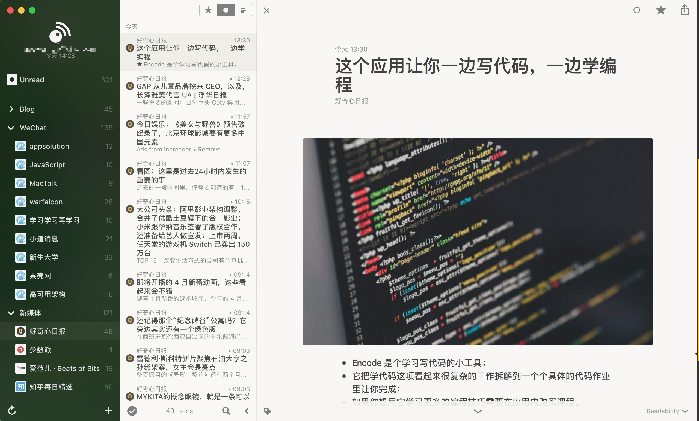

手机版长这个样子。

#### Day One记录美好

Day One无疑是apple平台下最好用的日记软件。 高颜值， 支持markdown成了书写✍️利器。 从另一个方面讲， Day One的排版特别适合写微信公众号文章， 写好了， 一复制， 一篇文章就OK了， 连排版都省了， 特别方便。
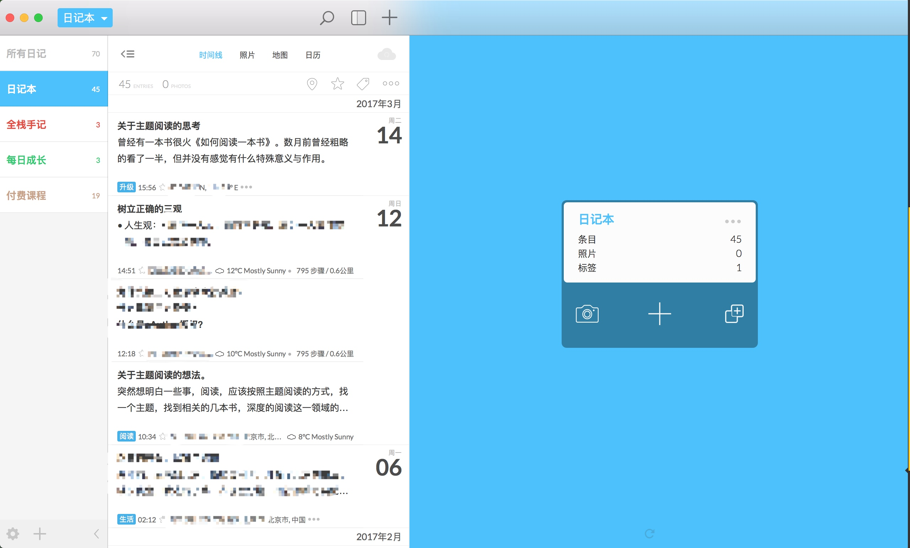

> 除此之外， 还有一大票应用， 就不一一介绍了， 包括但不局限于Mweb, Ulysses, 奇妙清单， BetterTouchTool等。

### iPhone 5s📱

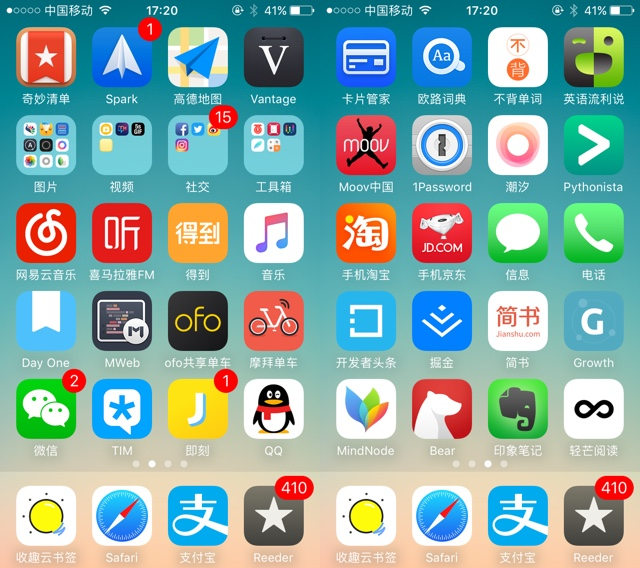

做为后PC💻时代的核心， 手机📱至关重要， 它占据了数字化生活相当一部分的比重。 相对于百家争鸣的Android收集， iPhone无疑更具有竞争力。 一部iPhone5s, 服役2年了， 除了电池🔋不耐用， 其它地方和新的没啥区别， 换一个钢化玻璃膜， 那颜值， 简直美哭。

### iPad Air

作为主打娱乐的产物， 无疑被我冷落了。 这台iPad伴随我三年了， 还好仅仅把它当做一台娱乐设备， 没有太多的依赖， 16G内存勉强够用。 没事看看视频， 有事儿了看看pdf文件， 也挺好。

### LG 21:9显示器🖥

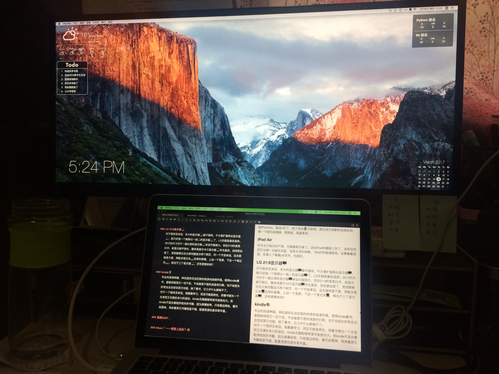
对于程序员来说， 多大的显示器🖥都不够用， 不方便扩展两台显示器🖥， 那只好选一个能够以一敌二的显示器🖥了， LG无疑是最佳选择。 25寸的尺寸对于一般比例的显示器🖥来说可能很大， 但在21:9的宽高比中， 却显示扁平狭长， 整体高度与19寸显示器🖥并无差异， 但却更加宽了， 宽到能够左右分屏完整显示两个网页， 对一个开发来说， 这无疑很是方便， 再配合笔记本💻自带的屏幕， 上边一个宽屏， 下边一个笔记本💻， 相当于三个显示器🖥， 还有更爽的吗？

### kindle📚

专业的阅读神器， 神在提供无法匹敌的纯净的阅读环境。 使用kindle看书， 能够排除其它一切干扰， 不会被是不是的消息所打断， 也不会因为好奇去点击尝试其它功能， 除了看书， 它几乎什么都做不了。
对于一个程序员来说， 我需要学习， 而且可能是终生， 而看书做为一个古老而又充满生命力的途径， kindle无疑能够将读书发扬光大。 但kindle不适合看程序相关的书籍， 因为屏幕较窄， 只有黑边两色， 看代码费神， 用来看其它书籍很是不错， 配套资源也是非常丰富。

### 魅族Ep51🎧

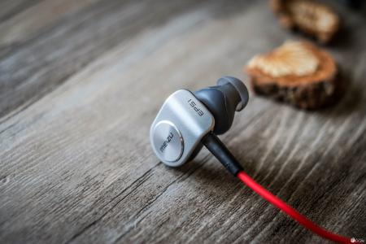
颜值很高的一款蓝牙耳机， 虽然咱没有魅族手机， 但这款耳机确实特别喜爱， 当初想买一个耳机， 无奈官网没货， 跑到实体店刷卡买了一个。
因为是蓝牙的， 所以听歌很方便， 不用担心线的问题， 跑步的时候也可以无忧无虑的使用。 缺点就是与iPhone一同使用的时候， 中间的按键只能起到开机、 关机、 蓝牙匹配、 暂停、 播放的功能， 并不能实现下一首、 重播、 上一首等功能。 不过这也不太重要不是吗。

### Moov⌚️——想爱上运动🏃吗

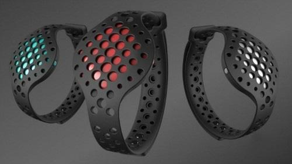
Moov手环进入中国了， 相比与国内的WeCoach, Moov无疑做的更好， 虽然到现在为止也没用上拳击功能， 但真心很期待， 过阵子不太忙了， 在买一只， 两只手各带一只， 就可以打拳击了。
Moov目前支持以下运动

- 游泳， 能够准确的记录游泳的距离、 划频等参数， 还能分辨出泳姿。
- 有氧拳击， 支持一个手环和两个手环， 当然两个手环是最好的， 使用起来就和打游戏一样， 有模有样， 感觉超级棒。
- 跑步， 支持效率跑、 速度耐力跑、 健走、 冲刺跑、 自由跑共五种模式， 大部分都可以在跑步机上进行。
- 骑行， 支持室内骑行和室外骑行。
- 七分钟运动， 简单的七分钟运动， 关键在于能够分析判断出是否完成了某个动作， 以及是否标准， 再也不用担心偷懒了。

共五种运动， 根据佩戴位置不同能够检测运动状况， 并通过耳机事实提醒， 鼓励， 针对不规范动作进行纠正。 初次之外还有睡眠检测功能。 佩戴舒适， 关键是电池使用寿命长达6个月， 带上就不用操心了。 每一项运动都分很多级别， 低级别进行解锁才能使用高级别。

> 2016年过去了， 伴随着众多心爱的设备， 渡过了一整年， 愿2017年更加有意义。

