> [多种图表的比较](https://antv.alipay.com/vis/doc/chart/classify/compare.html)

## 柱状图

> 使用柱子显示类别之间的数值比较。其中一个轴表示需要对比的分类维度，另一个轴代表相应的数值。

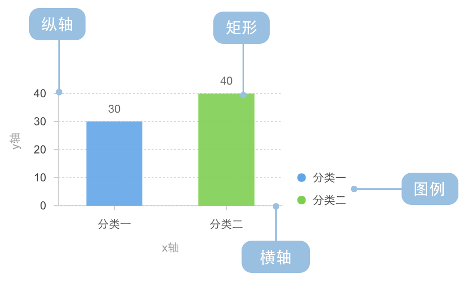

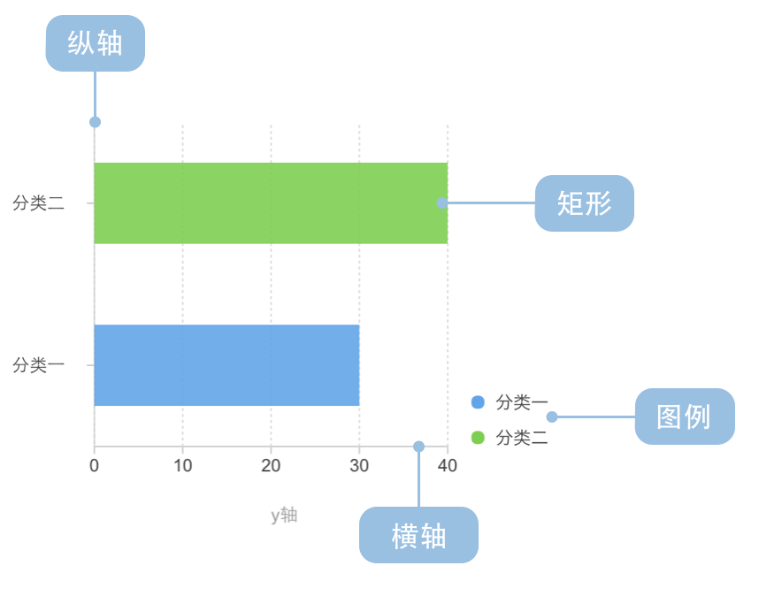

### 特点

* 柱状图描述的是分类数据，回答的是每一个分类中“有多少？

### 缺点

* 柱状图无法显示数据在一个区间内的连续变化趋势。
* 当柱状图显示的分类很多时会导致分类名层叠等显示问题。

### 适合的场景

* 适合应用到分类数据对比

### 不适合的场景

* 分类太多不适合使用纵向柱状图。
* 不适合表示趋势。

## 气泡图

> 气泡图是一种多变量图表，是散点图的变体，也可以认为是散点图和百分比区域图的组合。

气泡图最基本的用法是使用三个值来确定每个数据序列，和散点图一样，气泡图将两个维度的数据值分别映射为笛卡尔坐标系上的坐标点，其中 X 和 Y 轴分别代表不同的两个维度的数据，但是不同于散点图的是，气泡图的每个气泡都有分类信息（他们显示在点旁边或者作为图例）。每一个气泡的面积代表第三个数值数据。另外还可以使用不同的颜色来区分分类数据或者其他的数值数据，或者使用亮度或者透明度。表示时间维度的数据时，可以将时间维度作为直角坐标系中的一个维度，或者结合动画来表现数据随着时间的变化情况。

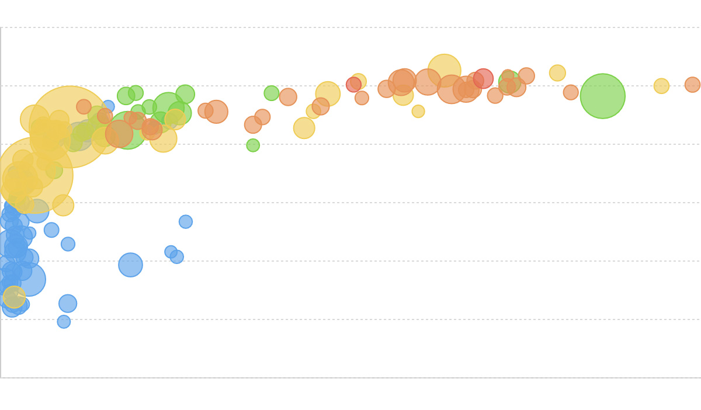

### 特点

* 气泡图通常用于比较和展示不同类别圆点（这里我们称为气泡）之间的关系，通过气泡的位置以及面积大小。
* 从整体上看，气泡图可用于分析数据之间的相关性。

### 应用场景

* 分类对比数据
* 多变量映射，用于分析数据的相关性
* 与地图的结合

## 双向柱状图

> 双向柱状图（又名正负条形图），使用正向和反向的柱子显示类别之间的数值比较。其中分类轴表示需要对比的分类维度，连续轴代表相应的数值，分为两种情况，一种是正向刻度值与反向刻度值完全对称，另一种是正向刻度值与反向刻度值反向对称，即互为相反数。

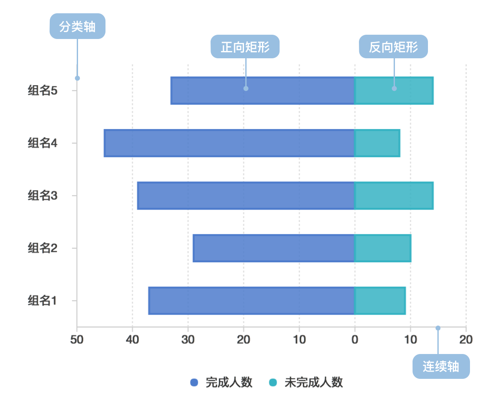

### 适合的场景

* 正反分类数据对比

### 不适合的场景

* 不含相反含义的数据

### 扩展

* 层叠双向柱状图
* 分组双向柱状图

## 子弹图

> 子弹图的样子很像子弹射出后带出的轨道，所以称为子弹图。子弹图的发明是为了取代仪表盘上常见的那种里程表，时速表等基于圆形的信息表达方式。

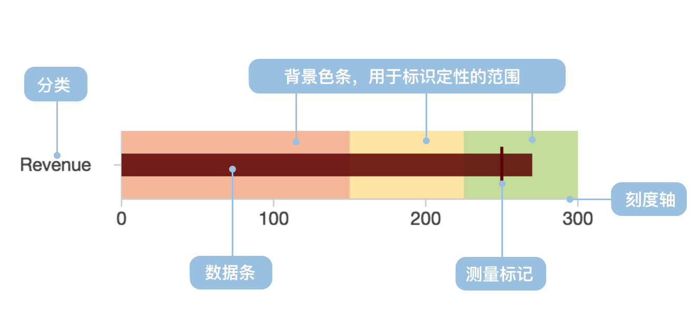

### 特点

* 每一个单元的子弹图只能显示单一的数据信息源
* 通过添加合理的度量标尺可以显示更精确的阶段性数据信息
* 通过优化设计还能够用于表达多项同类数据的对比
* 可以表达一项数据与不同目标的校对结果

### 适合的场景

* 显示阶段性数据信息，例如客户满意度评分。

### 扩展

* 反向子弹图
  + 表达负面（消极）数据时，可以将子弹图做方向上的反转。
* 层叠子弹图
  +  表达一些阶段性的数据时，例如，我们定义了全年的额定目标，但是每个季度都会阶段性地显示当前完成的进度，此时就需要同时表达每个季度的数据和全年整体的额定目标数据。

## 色块图

> 色块图，由小色块有序且紧凑的组成的图表。色块图的最大好处是，2维画布上的空间利用率非常高。理论上小色块的大小是可以等于硬件像素的大小。想象一下，如果用每个像素直接编码数值，一块200px*200px的小屏幕，也可以最多编码40000子项！

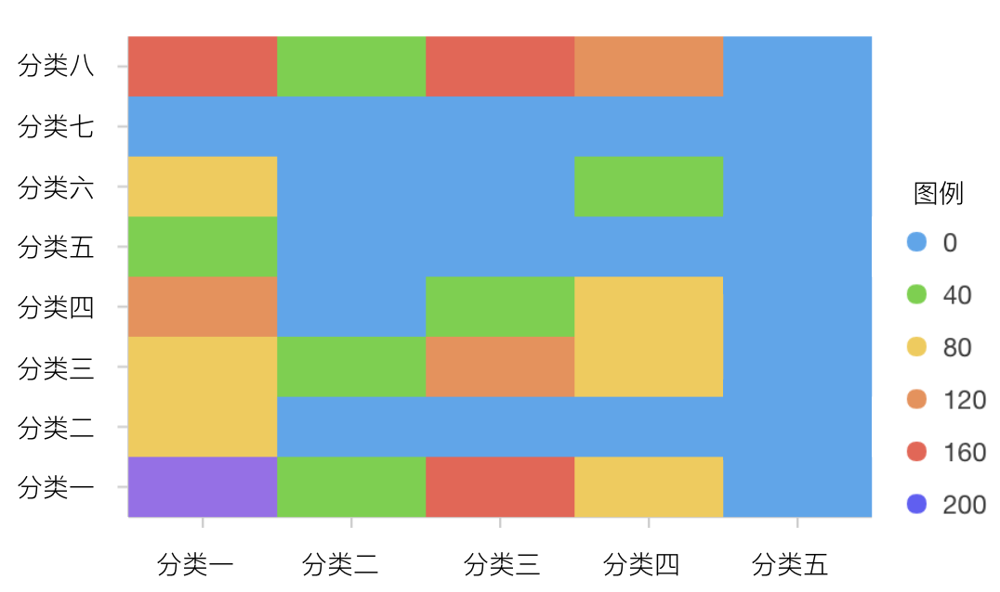

### 注意点

* 如果是应对展示用的场景，数据量不大、颜色分类数量小于或等于7个，可以采用分类的颜色映射。
* 如果应对，分析相关的需求，为了更有效率的使用色块图，我们建议使用连续（渐变）的颜色映射数值。由于人眼对颜色的分辨力有限，所以用于编码的颜色不宜过多，我们推荐的颜色的数量在3～11个之间。

### 适合的场景

* 适合应用到数据展示
* 适合应用到简单的数据分析
* 适合应用到聚类分析

## 漏斗图

> 漏斗图适用于业务流程比较规范、周期长、环节多的单流程单向分析，通过漏斗各环节业务数据的比较能够直观地发现和说明问题所在的环节，进而做出决策。漏斗图用梯形面积表示某个环节业务量与上一个环节之间的差异。漏斗图从上到下，有逻辑上的顺序关系，表现了随着业务流程的推进业务目标完成的情况。

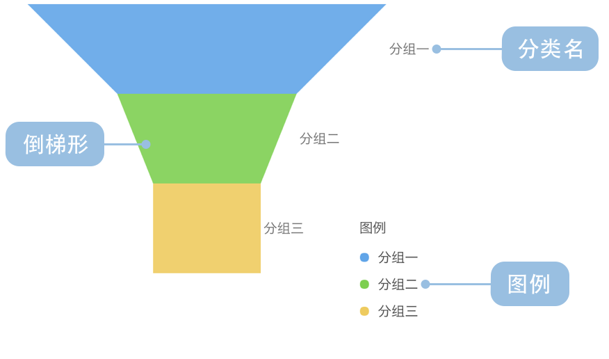

### 适合的场景

* 适用于流程流量分析。

### 不适合的场景

* 表示无逻辑顺序的分类对比。
* 也不适合表示占比情况

### 扩展

* 扩展图表一：金字塔图
  + 含义与用法与漏斗图基本类似，唯一区别是头部变尖。如果有定制化需求可利用该拓展。
* 扩展图表二：对比漏斗图
  + 对比漏斗图比基本漏斗图除了传达了流程的含义外，还传达了预期和实际情况的对比的含义，如下图：
* 扩展图表三：对称漏斗图
  + 对称漏斗图可以同时对两个业务流程进行分析，同时可以对这两个业务流程之间进行对比，如下图：

## 直方图

> 直方图，形状类似柱状图却有着与柱状图完全不同的含义。直方图牵涉统计学的概念

* 首先要对数据进行分组，然后统计每个分组内数据元的数量。 在平面直角坐标系中，横轴标出每个组的端点，纵轴表示频数，每个矩形的高代表对应的频数，称这样的统计图为频数分布直方图。
* 频数分布直方图需要经过频数乘以组距的计算过程才能得出每个分组的数量，同一个直方图的组距是一个固定不变的值，所以如果直接用纵轴表示数量，每个矩形的高代表对应的数据元数量，既能保持分布状态不变，又能直观的看出每个分组的数量。

### 频数分布直方图

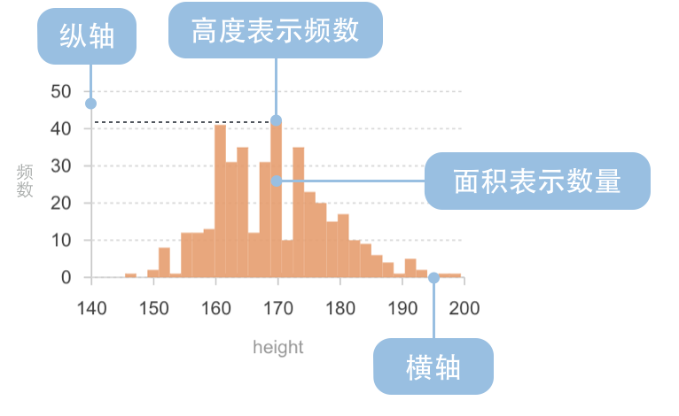

### 非标准的直方图

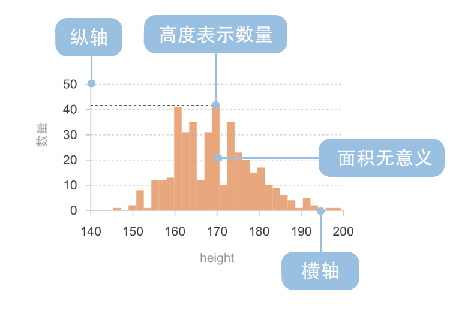

### 适合的场景

* 用于表示分布情况
* 用于观察异常或孤立数据

### 不适合的场景

* 抽取的样本数量过小，将会产生较大误差，可信度低，也就失去了统计的意义。因此，样本数不应少于 50 个。

### 扩展

* 通过变换坐标系，我们能获得极坐标下的直方图、圆环上的直方图、以及翻转的直方图。

## K 线图

> K 线图，原名蜡烛图，又称阴阳图、棒线、红黑线或蜡烛线，常用于展示股票交易数据。K 线就是指将各种股票每日、每周、每月的开盘价、收盘价、最高价、最低价等涨跌变化状况，用图形的方式表现出来。

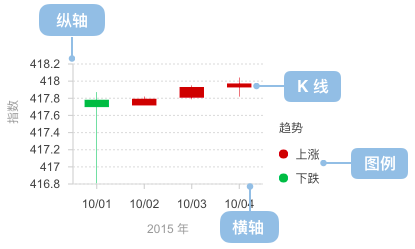

### 说明

1. 最上方的一条细线称为上影线，中间的一条粗线为实体，下面的一条细线为下影线。
2. 当收盘价高于开盘价，也就是股价走势呈上升趋势时，我们称这种情况下的 K 线为阳线，中部的实体以空白或红色表示。反之称为阴线用黑色实体或绿色表示。
3. 上影线的长度表示最高价和收盘价之间的价差，实体的长短代表收盘价与开盘价之间的价差，下影线的长度则代表开盘价和最低价之间的差距。

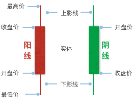

### 应用场景

* K 线图主要用于金融领域里展示股票，期货等交易数据，按照时间维度分为日 K 线、周 K 线、月 K 线。展示的数据需要满足 K 线构成的四要素：即开盘价、收盘价、最高价、最低价。

## 马赛克图

> 马赛克图(Mosaic Plot 又名 Marimekko Chart)。标准的、非均匀的马赛克图在现实生活中使用较少，多用于统计学领域，常用于SAS的某些模块。均匀的马赛克图在生活中常有应用，比较经典的例子是地铁站与站之间的票价图。

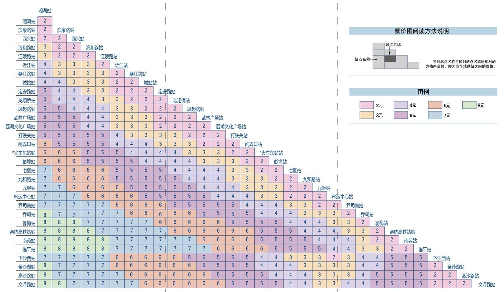

### 非均匀坐标轴马赛克图

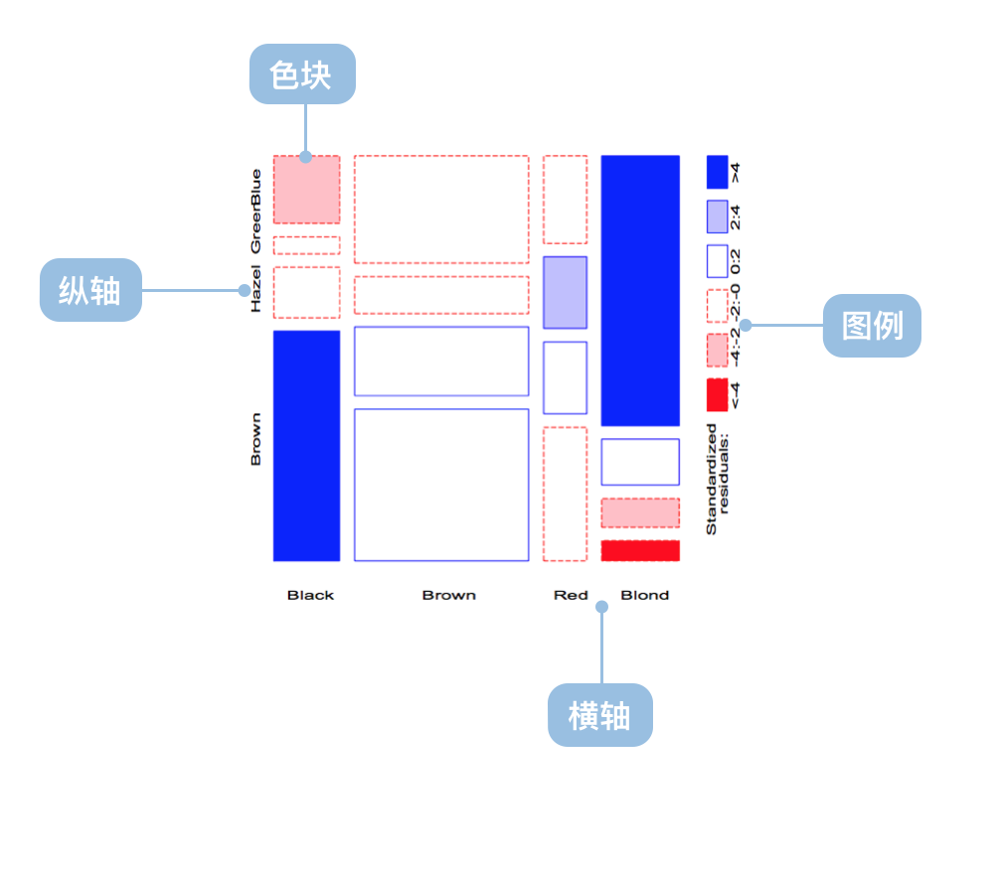

### 均匀坐标轴马赛克图

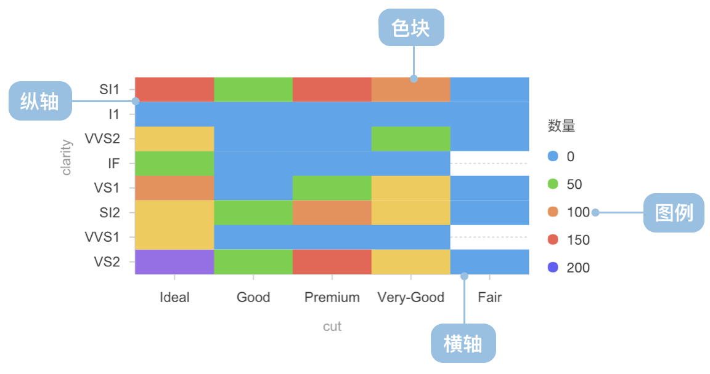

### 适合的场景

* 统计分析，非均匀马赛克图
* 统计分析，均匀马赛克图

## 分组柱状图

> 分组柱状图，又叫聚合柱状图。当使用者需要在同一个轴上显示各个分类下不同的分组时，需要用到分组柱状图。
> 跟柱状图类似，使用柱子的高度来映射和对比数据值。每个分组中的柱子使用不同的颜色或者相同颜色不同透明的方式区别各个分类，各个分组之间需要保持间隔。

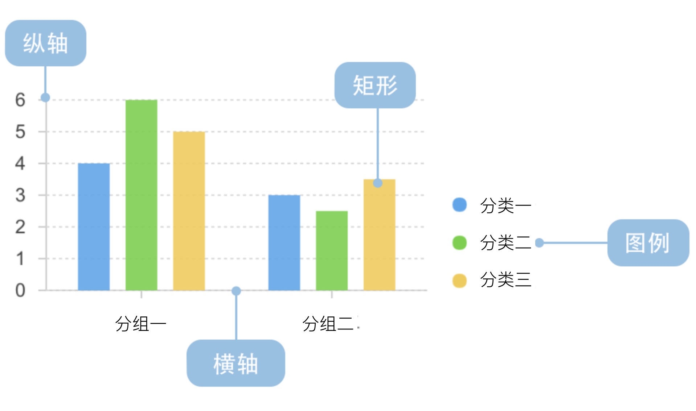

### 适合的场景

* 对比不同分组内相同分类的大小，对比相同分组内不同分类的大小

### 不适合的场景

* 分组过多、分类过多

## 雷达图

> 雷达又叫戴布拉图、蜘蛛网图。传统的雷达图被认为是一种表现多维（4维以上）数据的图表。它将多个维度的数据量映射到坐标轴上，这些坐标轴起始于同一个圆心点，通常结束于圆周边缘，将同一组的点使用线连接起来就称为了雷达图。它可以将多维数据进行展示，但是点的相对位置和坐标轴之间的夹角是没有任何信息量的。在坐标轴设置恰当的情况下雷达图所围面积能表现出一些信息量。

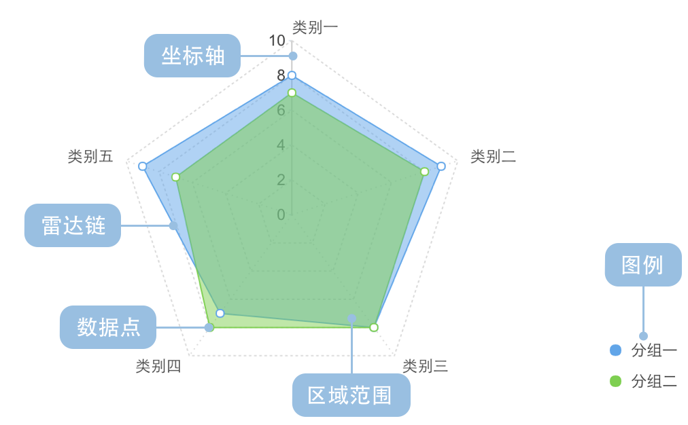

### 缺点

* 如果雷达图上多边形过多会使可读性下降，使整体图形过于混乱。特别是有颜色填充的多边形的情况，上层会遮挡覆盖下层多边形。

* 如果变量过多，也会造成可读性下降，因为一个变量对应一个坐标轴，这样会使坐标轴过于密集，使图表给人感觉很复杂。所以最佳实践就是尽可能控制变量的数量使雷达图保持简单清晰。

### 使用场景

* 多维对比－单雷达链
* 多组多维对比－多雷达链

## 玉玦图

> 玉玦图（又名，环形柱状图），是柱状图关于笛卡尔坐标系转换到极坐标系的仿射变换。其意义和用法与柱状图类似。
> 玉玦图有半价反馈效应。由于玉玦图中是用角度表示每个玦环数值的大小，角度是决定性因素。所以，哪怕外侧（半径大的）玦环的数值小于内侧（半径小的）玦环，外侧的每个玦环会相对的比里面的玦环更长。这会造成视觉上的误解。
> 而且因为我们的视觉系统更善于比较直线，所以笛卡尔坐标系更适合于比较各个分类的数值比较。所以玉玦图从实用的角度去看，其更多的是一种审美上的需求。

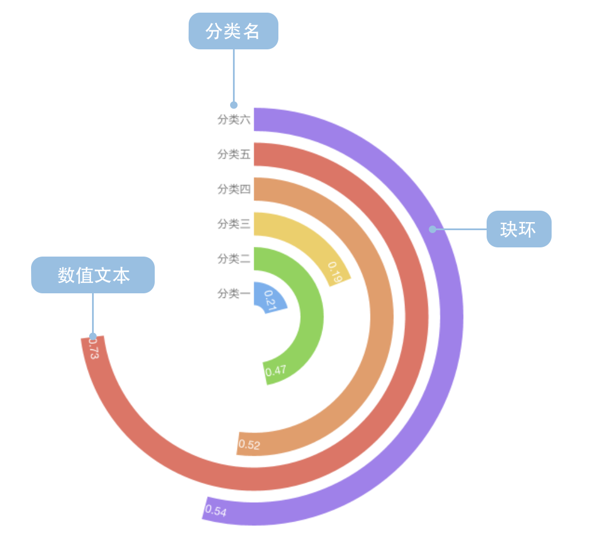

### 适合的场景

* 美国民众对不同领域中的中美问题关注程度。
* 各国人民认为气候变化是严重问题的比例。

### 误用场景

* 简介中提到玉玦图具有半径反馈效应。视觉上半径越大的玦环会看起来更大，半径小的则小。造成玉玦图的误用（见左图）。所以，我们认为玉玦图使用时必须进行排序（见右图）。

## 南丁格尔玫瑰图

> 南丁格尔玫瑰图又名鸡冠花图、极坐标区域图，是南丁格尔在克里米亚战争期间提交的一份关于士兵死伤的报告时发明的一种图表。
> 南丁格尔玫瑰图是在极坐标下绘制的柱状图，使用圆弧的半径长短表示数据的大小（数量的多少）。

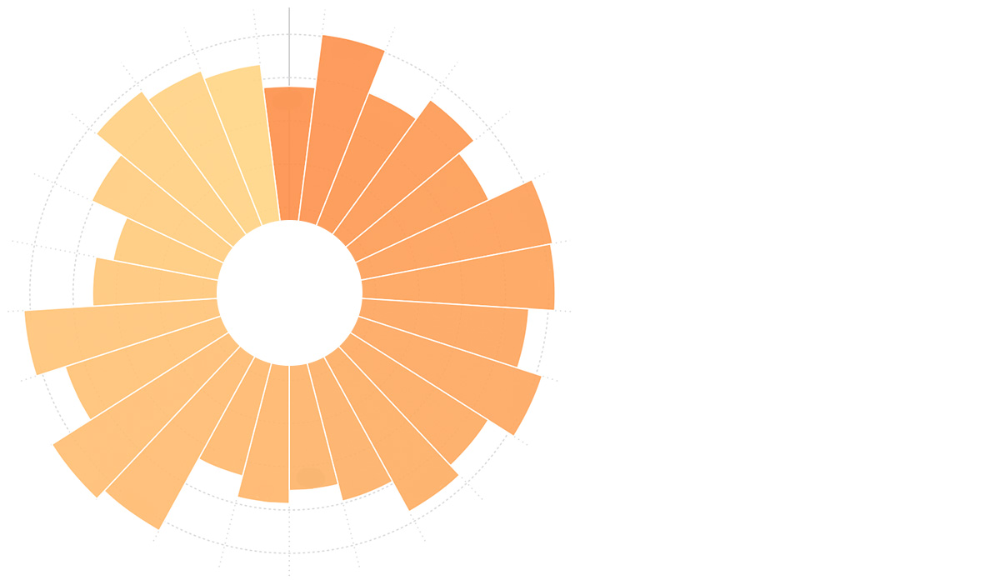

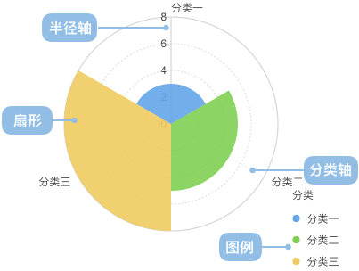

### 适合的场景

* 对比不同分类的大小

### 不适合的场景

* 分类过少的场景

### 扩展

* 扇形玫瑰图
  + 通过设置极坐标的起始角度可以实现扇形南丁格尔玫瑰图。
* 层叠的玫瑰图
  + 南丁格尔玫瑰图的实现原理是将柱状图在极坐标下绘制，如果将柱状图扩展为层叠柱状图，同样可以实现层叠的玫瑰图

## 螺旋图

> 螺旋图，基于阿基米德螺旋坐标系，常用于绘制随时间变化的数据，从螺旋的中心开始向外绘制。

**螺旋图有两大好处：**

* 绘制大量数据：螺旋图节省空间，可用于显示大时间段数据的变化趋势；
* 绘制周期性数据：螺旋图每一圈的刻度差相同，当每一圈的刻度差是数据周期的倍数时，能够直观的表达数据的周期性。

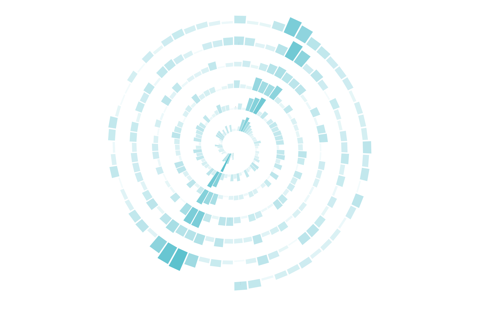

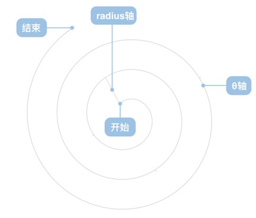

### 适合的场景

* 展示大量数据的变化趋势
* 展示数据的周期

### 扩展

* 螺旋色块图
  + 通过自定义shape把柱状图的每个数据填满当前区域并调整柱状图的宽度，可以绘制出螺旋色块图

## 层叠面积图

> 层叠面积图和基本面积图一样，唯一的区别就是图上每一个数据集的起点不同，起点是基于前一个数据集的，用于显示每个数值所占大小随时间或类别变化的趋势线，展示的是部分与整体的关系。
> 层叠面积图上的最大的面积代表了所有的数据量的总和，是一个整体。各个叠起来的面积表示各个数据量的大小，这些堆叠起来的面积图在表现大数据的总量分量的变化情况时格外有用，所以层叠面积图不适用于表示带有负值的数据集。非常适用于对比多变量随时间变化的情况。
> 在层叠面积图的基础之上，将各个面积的因变量的数据使用加和后的总量进行归一化就形成了百分比层叠面积图。该图并不能反映总量的变化，但是可以清晰的反应每个数值所占百分比随时间或类别变化的趋势线，对于分析自变量是大数据、时变数据、有序数据时各个指标分量占比极为有用。

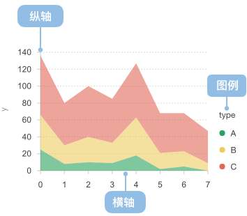

### 适合场景

* 百分比层叠面积图
* 游戏公司在2001，2002，2003，2004 几年内不同分类的游戏的销售情况

### 不适合的场景

* 分类数据的比较不要使用面积图。

## 层叠柱状图

> 与并排显示分类的分组柱状图不同，层叠柱状图将每个柱子进行分割以显示相同类型下各个数据的大小情况。它可以形象得展示一个大分类包含的每个小分类的数据，以及各个小分类的占比，显示的是单个项目与整体之间的关系。我们将层叠柱状图分为两种类型：
> 一般的层叠柱状图：每一根柱子上的值分别代表不同的数据大小，各层的数据总和代表整根柱子的高度。非常适用于比较每个分组的数据总量。
> 百分比的层叠柱状图：柱子的各个层代表的是该类别数据占该分组总体数据的百分比。
> 层叠柱状图的一个缺点是当柱子上的层叠太多时会导致数据很难区分对比，同时很难对比不同分类下相同维度的数据，因为它们不是按照同一基准线对齐的。

### 一般层叠柱状图

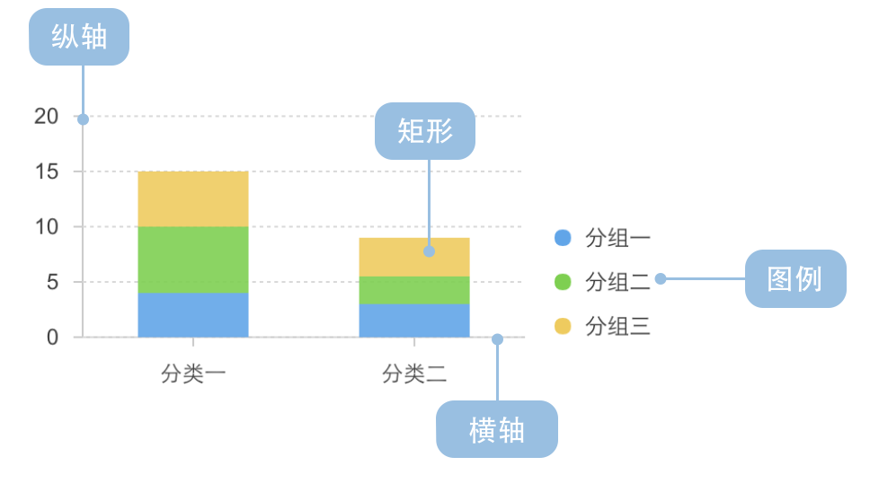

#### 适合的场景

* 对比不同分组的总量大小，同时对比同一分组内不同分类的大小。

#### 不适合的场景

* 一般层叠柱状图各个分组内不同分类的基准线不同，所以不适合对比不同化妆品在不同城市的销售量

### 百分比柱状图

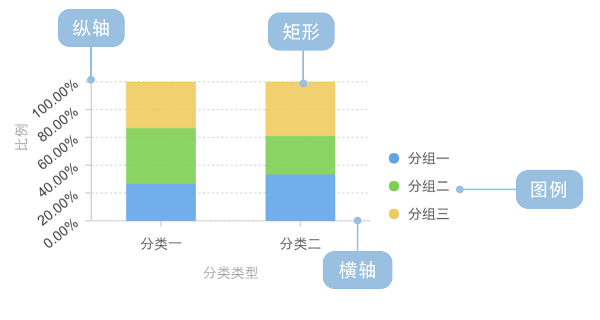

#### 适合的场景

* 观察分类占比情况

#### 不适合的场景

* 对比不同分组内同个分类的数据大小
* 对比各分组总数的大小

### 扩展

* 纵向柱状图建议展示的数据条数较少，当分类过多时，我们可以使用横向的层叠柱状图。横向柱状图的介绍详见柱状图

## 矩形树图

矩形树图由马里兰大学教授Ben Shneiderman于上个世纪90年代提出，起初是为了找到一种有效了解磁盘空间使用情况的方法。 矩形树图适合展现具有层级关系的数据，能够直观体现同级之间的比较。一个Tree状结构转化为平面空间矩形的状态，就像一张地图，指引我们发现探索数据背后的故事。

矩形树图采用矩形表示层次结构里的节点，父子节点之间的层次关系用矩形之间的相互嵌套隐喻来表达。从根节点开始，屏幕空间根据相应的子节点数目被分为多个矩形，矩形的面积大小通常对应节点的属性。每个矩形又按照相应节点的子节点递归的进行分割，知道叶子节点为止。

矩形树图的好处在于，相比起传统的树形结构图，矩形树图能更有效得利用空间，并且拥有展示占比的功能。矩形树图的缺点在于，当分类占比太小的时候文本会变得很难排布。相比起分叉树图，矩形树图的树形数据结构表达的不够直观、明确。

矩形树图的布局算法非常多，而且经常为可视化工程师津津乐道。但介绍具体实现并不是AntV目前的职责，有兴趣的同学可以参见拓展阅读部分。

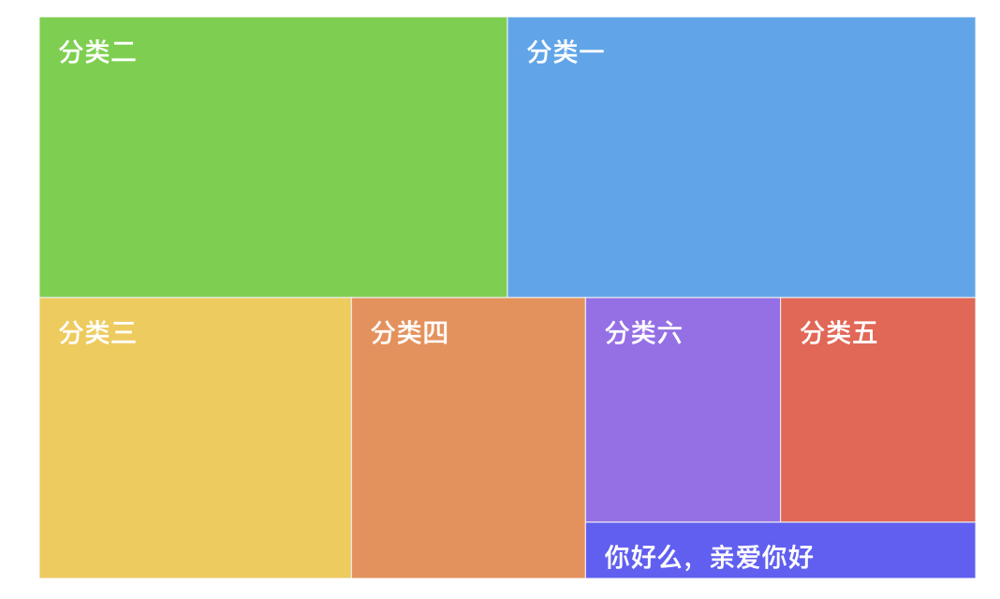

### 适合的场景

* 适合展示带权的树形数据。

### 不适合的场景

* 没有权重关系，且需要明显展示层级关系，用分叉树图更合适

## 词云

词云，又称文字云，是文本数据的视觉表示，由词汇组成类似云的彩色图形，用于展示大量文本数据。通常用于描述网站上的关键字元数据（标签），或可视化自由格式文本。 每个词的重要性以字体大小或颜色显示。 词云的作用：

* 快速感知最突出的文字
* 快速定位按字母顺序排列的文字中相对突出的部分

词云的本质是点图，是在相应坐标点绘制具有特定样式的文字的结果

### 适合的场景

* 对比大量文本
* 使用图片做边界限制

### 不适合的场景

* 数据太少
* 使用图片做边界限制

[图表对象配置（chart）](https://antv.alipay.com/g2/doc/tutorial/start/chart.html)

> 以上内容整理自 [AntV](https://antv.alipay.com/index.html)
